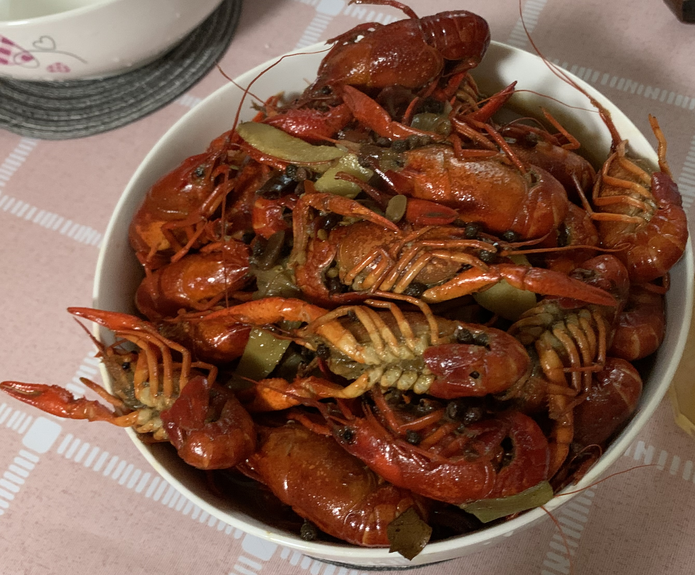

# Crayfish Recipe

Homemade crayfish, tender meat, juicy, clean and hygienic.

Estimated cooking difficulty: ★★★★

## Essential Ingredients and Tools

- Crayfish
- Oil
- Bay leaves
- Star anise
- Cinnamon
- Green Sichuan peppercorns
- Sichuan peppercorns
- Bullet chili
- Scallions, ginger, garlic
- Pixian Doubanjiang (chili bean paste)
- Soybean paste
- Beer
- Light soy sauce
- Salt

## Measurements

The following is the amount for two pounds of crayfish, just adjust proportionally.

- Crayfish = 2 pounds
- Oil = 70 ml (3 times the amount of usual stir-frying)
- Bay leaves = two pieces
- Star anise = one
- Cinnamon = 3 grams
- Green Sichuan peppercorns = 10 grams
- Sichuan peppercorns = 10 grams
- Bullet chili = 5 grams
- Scallions = one large scallion
- Ginger = 30 grams
- Garlic = 7 cloves of garlic
- Pixian Doubanjiang = 30 grams
- Soybean paste = 30 grams
- Beer = 500 ml
- Light soy sauce = 30 ml
- Salt = 10 grams

## Instructions

- Scrub the crayfish clean and remove the shrimp line, cut the scallions into 2cm sections, mince the ginger and garlic.
- Heat the oil, when the oil is slightly hot, add bay leaves, star anise, cinnamon, green Sichuan peppercorns, Sichuan peppercorns, and bullet chili.
- After the spices release their aroma, add the scallions, ginger, and garlic
- After the scallions, ginger, and garlic are fragrant, add Pixian Doubanjiang and soybean paste, and stir-fry until red oil appears.
- Add the crayfish and stir-fry until they change color.
- Add beer, and after the beer boils, add light soy sauce and salt.
- After the crayfish are completely cooked, remove from the pot.

## Additional Notes

Restaurants should deep-fry it once, but it is too wasteful for home frying, so in this recipe, use more oil than stir-frying oil and fry it a little. The actual test is also delicious.

The shrimp meat after removing the shrimp line has a slightly worse taste than the shrimp meat without the shrimp line, and removing the shrimp line from the crayfish is a challenge for novices. It is also possible not to remove the shrimp line if you can accept the shrimp line.

If you follow this guide and find issues or areas for improvement, please submit an Issue or Pull Request.
