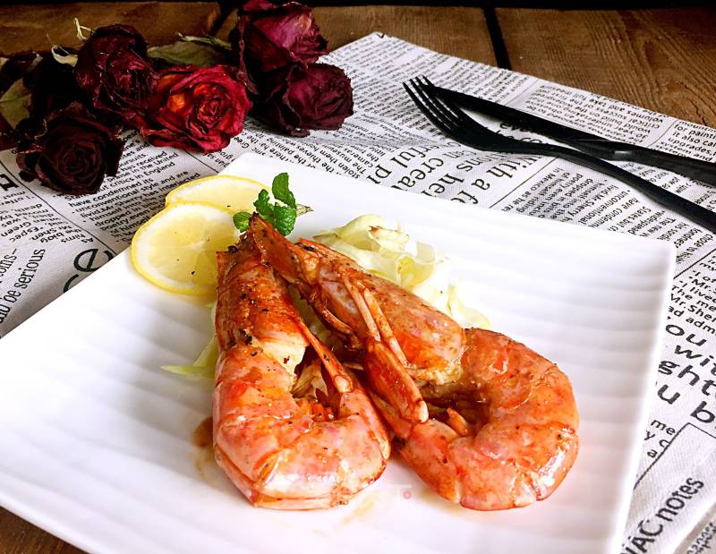

# Pan-Fried Argentinian Red Shrimp Recipe

The shrimp we usually see only turn red after being plunged into "boiling water" or "fire"! Argentinian shrimp are quite something – they're red from the moment they're born and stay that way! Just like their relatives in the Arctic, Arctic shrimp, they are naturally red.

Argentinian red shrimp are this vibrant color because they live in the deep sea, which causes their bodies to contain rich amounts of iodine, phosphorus, and precious astaxanthin and other trace elements. These can enhance the human body's immunity and also play an important regulatory role in heart activity, potentially reducing cholesterol levels in the blood.

Argentinian red shrimp are not only large and plump with meat as white as congealed fat and a delicate, rich texture, but they also have a fresh, tender taste with a sweet and intense aroma. They are the darling of the shrimp culinary world, looking so tempting that they make mouths water, urging you to quickly indulge in the pleasure of devouring them!

**Estimated Cooking Difficulty:** ★★★

## Essential Ingredients and Tools

- Argentinian red shrimp (Costco frozen shrimp were used)
- Mediterranean sea salt (grinder)
- Black pepper (grinder)
- White wine
- Light soy sauce
- Cilantro
- Lemon
- Onion
- Ginger
- Garlic

## Measurements

- Argentinian red shrimp: 2-3 pieces
- Mediterranean sea salt: 5g
- Black pepper (grinder): to taste
- White wine: 20ml
- Light soy sauce: 1ml
- Cilantro: 3 sprigs
- Lemon: 1 slice
- Onion: 10g
- Ginger: 10g
- Garlic: 10g

## Instructions

- Thaw the Argentinian red shrimp, preferably by transferring them from the freezer to the refrigerator the day before to thaw naturally. This helps maintain better flavor and texture. The Costco shrimp used were already deveined and butterflied, saving a lot of time.
- Wash the thawed shrimp and pat them dry. Note that it's crucial to drain them well; if you're in a hurry, use paper towels to absorb the moisture.
- Slice the ginger, dice the onion, wash the cilantro and separate the leaves from the stems. Finely chop the cilantro leaves and crush the garlic into small minced pieces.
- Heat a wok or frying pan over high heat. Once hot, add two tablespoons of olive oil. When the oil is hot, add the ginger slices, onion pieces, and cilantro stems and stir-fry.
- After about one minute, remove the ginger, onion, and cilantro stems and discard them.
- Adjust the heat to medium-high, add the red shrimp and start pan-frying. Ensure all shrimp have full contact with the bottom of the pan on one side. Fry for about 2 minutes, brushing each shrimp with a layer of oil at the same time.
- Once the underside of the shrimp shells has slightly browned, flip them over, sprinkle with minced garlic, and gently shake the pan to ensure even heating.
- After about 1 minute, add 20ml of white wine.
- Fry for another 1 minute, then reduce the heat to medium-low and evenly sprinkle with salt and black pepper.
- Drizzle one drop of light soy sauce onto each shrimp.
- Sprinkle with chopped cilantro leaves and transfer to a serving plate.
- Slice the lemon and arrange the slices on the side of the plate.

## Additional Notes

- Lemon can enhance the flavor of the shrimp, but it has a sour taste, so add it according to your preference or omit it.
- Serve hot.

If you follow the preparation process in this guide and find any issues or have suggestions for improvement, please submit an Issue or Pull request.