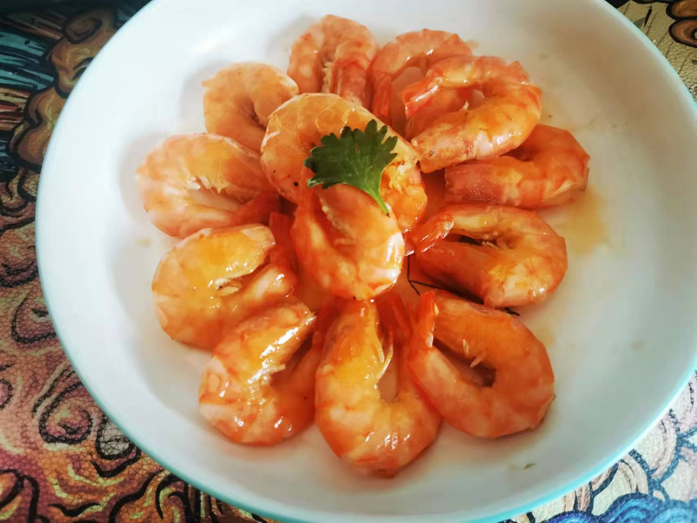

# Braised Shrimp Recipe

Estimated cooking difficulty: ★★★★

## Essential Ingredients and Tools

- Black tiger shrimp or white shrimp
- Scallions, ginger
- Cooking wine, salt, rock sugar, vegetable oil

## Measurements

Version for 1 person.

- 10 shrimp
- 5g Sichuan peppercorns
- 50g scallions
- 20g ginger
- 30g yellow wine
- 3g salt
- 10g rock sugar
- Vegetable oil

## Instructions

- Cut off the shrimp spears to the root, cut off the shrimp whiskers and claws, remove the sandbag, open the back and take out the shrimp line, wash and set aside
- Fry the flavored oil
  - Put Sichuan peppercorns in the oil when the oil temperature is 30% hot, remove from the heat when the oil is hot, add scallions and ginger (it is best not to let the oil change color), drain the oil when the scallions turn slightly yellow (you can keep the scallion oil for mixing noodles).
- Add oil, arrange the shrimp neatly, gently press the shrimp heads after both sides change color
  - Add ginger rice (ginger cut into fine particles)
  - 30g yellow wine
  - Two small bowls of water
  - 3g salt
  - 10g rock sugar
- Bring to a boil over high heat, then turn to low heat and cover to simmer (do not add soup in the middle, do not open the lid)
- You can remove the pot when the skin is bright and the shrimp are bent, plate the shrimp
- Reduce the sauce (filter and pour back into the pot to thicken, add scallion oil) when 1/4 of the soup remains.
- Pour the sauce
- Complete
- 
- Start eating ✅

## Additional Notes

- Recipe reference: B station Lao Fan Gu video [Is the braised shrimp that I have eaten since I was a child actually fake? ](https://www.bilibili.com/video/BV17f4y1W7z9)

If you follow this guide and find issues or areas for improvement, please submit an Issue or Pull Request.
