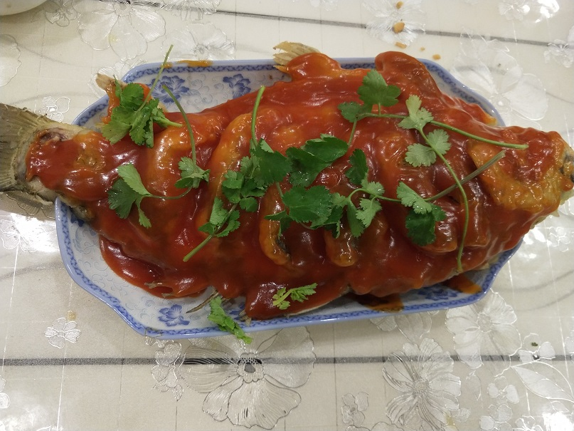

# Sweet and Sour Carp Recipe

Estimated cooking difficulty: ★★★★

## Essential Ingredients and Tools

- Carp
- Ketchup
- White sugar
- White vinegar
- Starch
- Salt
- Scallions
- Ginger
- Cooking wine
- Coriander sprig
- Basin (two)
- Kitchen knife
- Skimmer, spatula

## Measurements

Note that this dish only has a version for 3 or more people (fish that are too large or too small are not suitable), so there is no need for formula calculation. It is especially suitable for family gatherings, such as New Year's Eve dinners.

- Carp = approximately 3 pounds
- Water = 50g
- Ketchup = 40g
- White sugar = 20g
- White vinegar = 10g
- Starch = 10g
- Salt = 30g
- Scallions = 30g (about half)
- Ginger = 30g
- Cooking wine = 25g

## Instructions

- Clean the fish, making sure there are no scales or other foreign objects
- With the fish head facing left and the belly facing down, hold the knife in your right hand. Cut down 1cm vertically, press the fish firmly and slice 3-4cm to the left, then gently cut a knife in the middle of the fish slice
- Put the fish in a basin, then slice the ginger and cut the scallions into sections (just cut them casually, mainly to remove the fishy smell)
- Use the strength of feeding to squeeze the juice from the scallions and ginger into the basin
- Add 20g salt, 25g cooking wine, and then give the carp a bath, spreading evenly
- 

    (The longer the fish is marinated, the less fishy it will be. It is recommended to marinate for more than 30 minutes)

- Find a clean basin, add 100g flour, 200g starch, 180g water, 5g salt, and stir well with your hands. At this time, the batter is viscous and can be pulled into strands, then beat in an egg and stir again.
- Wait 30 minutes
- Place the fish on a cutting board and wipe the water off the fish with a dry towel (this will allow the batter to adhere better)
- Rinse the basin and wipe it dry with a dry towel
- Heat oil in a pot, add about 1L of oil, and heat the oil to 70% heat, about 200-240 degrees
- Pinch the tail of the fish, immerse the head of the fish in the bottom of the pot, and pour hot oil on the fish with a spoon. After the batter is formed, slowly put the fish into the pot, and gently lift the head of the fish with a spatula, and then put on a skimmer. Prevent the bottom from burning.
- Prepare a plate for the fish and place it next to the pot.
- Gently insert the spatula from the body of the fish, and turn the fish over with the cooperation of two tools. Fry for another two minutes, still in the same way (skimmer holding the fish head, spatula holding the fish body, and serving the fish on a plate)
- Pour the oil from the pot into a wiped dry basin and set aside, then brush the pot clean
- Put 50g water, 40g ketchup, 20g white sugar, and 10g white vinegar into a small bowl and stir well
- Prepare another small bowl, add 10g starch and 10g water, and stir into water starch
- Turn on high heat to heat the pot, then pour in the prepared sauce, bring to a boil over high heat, then turn to low heat
- Add the adjusted water starch, stirring while pouring, then turn off the heat after 20 seconds
- Spread the cooked sweet and sour sauce evenly on the fish with a spoon, you can add some coriander or chopped green onions to garnish, and the sweet and sour carp is ready
- 

    The sweet and sour sauce here is a bit thick...

## Additional Notes

This dish is of medium difficulty, and is not very friendly to novices...

If you follow this guide and find issues or areas for improvement, please submit an Issue or Pull Request.
