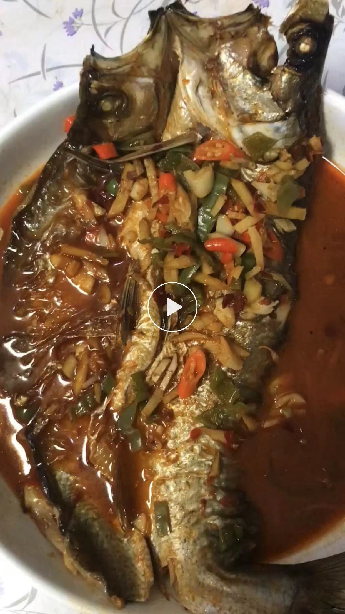

# Pan-Fried翘嘴鱼 Recipe

Estimated cooking difficulty: ★★★★

## Essential Ingredients and Tools

- 翘嘴鱼 (carnivorous fish, delicate meat, good taste)
- Ginger
- Scallions
- Garlic
- Green pepper
- Coriander
- Dark soy sauce
- White sugar
- Doubanjiang (chili bean paste)
- Cooking wine
- Light soy sauce
- Salt

## Measurements

Note: This amount is for about 2-3 people

Per serving:

- 翘嘴鱼: 2 catties is best
- Minced ginger: 20g
- Scallions: half a root (50g)
- Garlic: 4 cloves
- Coriander: personal taste
- Dark soy sauce: 2ml (optional if you don’t like strong flavors)
- White sugar: 10g
- Dried chili: 4-6 (choose according to personal taste)
- Cooking wine: 100ml
- Light soy sauce: 4ml
- Salt: about 50g for marinating the fish
- Cooking oil: 100ml

## Instructions

- Open the back of the fish and kill it (let the fish seller kill it, be sure not to kill the fish by dissecting the abdomen, remember to open the back), and clean it
- Spread salt evenly on the surface of the fish, pour in about 80ml of cooking wine, 20g of minced ginger, and put it in the refrigerator for 1-2 days
- Take out the marinated fish, hang it with a rope and dry it until it is half dry (about 1-2 days, the specific time needs to be combined with the temperature and sunlight)
- Please wash the fish with clean water before eating, and drain the water (to prevent water from splashing when it meets oil)
- Turn on high heat to heat the pot, quickly change to low heat, put oil in the pot, try to keep the entire surface of the pot oiled, and slide the fish along the edge of the pot into the pot (fry the back first)
- After the fish enters the pot (and after turning it over), don’t rush to move the position of the fish (it is easy to break the skin at this time), try shaking the pot after frying for about 30 seconds
- After frying the back for about 1 minute, turn over and fry for about 1-2 minutes, fry until golden brown on both sides
- When both sides are fried, push the fish to the side of the pot a little, leave some space to put the Doubanjiang and stir-fry until fragrant, add ginger and garlic,
- After stir-frying the flavor of the ingredients, add cooking wine, light soy sauce, dark soy sauce, pour in hot water, the amount of water is level with or less than the fish
- At this time, change to medium-high heat, cook for 5-10 minutes, then add green pepper sections, white sugar, chicken essence, thirteen incense, and aged vinegar
- Change to low heat for 2-5 minutes, add scallions and coriander, and it can be out of the pot

## Additional Notes

- Remember that the fish is killed by opening the back. When marinating, just spread the salt evenly on the surface of the fish. The marinating time and drying time are 1-2 days.
- Fry the fish over low heat, and do not move the fish when it first enters the pot, it will break the skin
- Pay attention to observe the degree of ripeness after putting in the green pepper sections. The green peppers inside are delicious. In addition, put the coriander last.
- Pay attention to the switching of heat, the freshness enhancement effect of Doubanjiang and white sugar, and the aroma enhancement effect of aged vinegar

If you follow this guide and find issues or areas for improvement, please submit an Issue or Pull Request.
