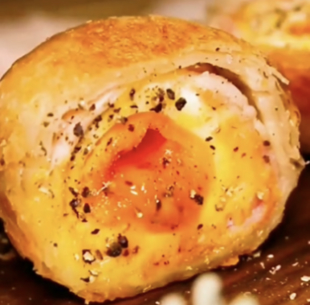
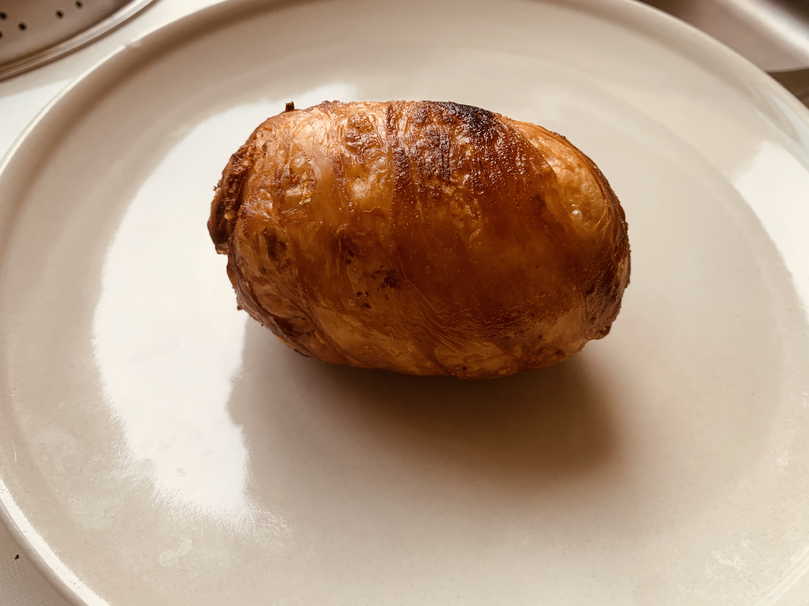
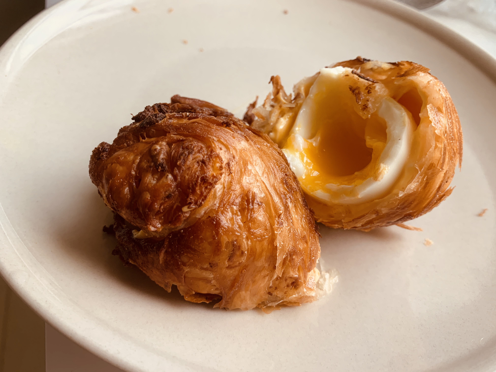

# How to Make Scotch Eggs

Scotch egg is made by wrapping an egg in fresh minced meat and deep-frying it until golden brown. This version is quite laborious, so here's a simplified version for everyone. For the complex version of Scotch eggs, please search for it yourself.

The simplified version of Scotch eggs is made by wrapping a soft-boiled egg with cheese and bacon in a scallion pancake, then deep-frying it until golden brown. It takes about 20-30 minutes.

Estimated cooking difficulty: ★★★

## Essential Ingredients and Tools

- Eggs
- Scallion pancakes
- Cheese slices
- Bacon slices
- Air fryer or deep fryer

## Calculation

> For one serving

- Egg 50g (about 1)
- Scallion pancake 1-2 (depending on the size of the egg)
- Cheese slices 1-2
- Bacon slices 1-2

## Instructions

- Put eggs in cold water and cook for 3 minutes after the water boils, then remove.
- Put the eggs in ice water for faster and more complete peeling.
- Wrap the egg with cheese slices.
- Wrap the egg with bacon slices.
- Cut off both ends of the scallion pancake to wrap the egg in a rectangular shape.
- Deep fry in oil at 160°C (when the oil surface ripples, there is light smoke, and bubbles appear around chopsticks inserted into the oil). Fry until golden brown.
- Air fryer at 160°C for 15 minutes.
- Cut open and serve.

## Additional Information

- Cheese slices, bacon slices, and scallion pancakes can be purchased directly from Taobao.

If you follow the production process in this guide and find any problems or processes that can be improved, please submit an Issue or Pull request.