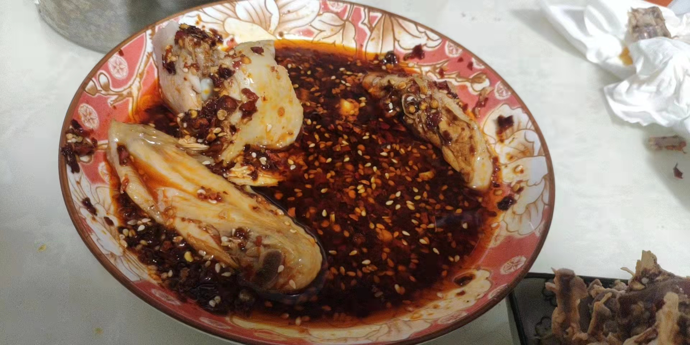
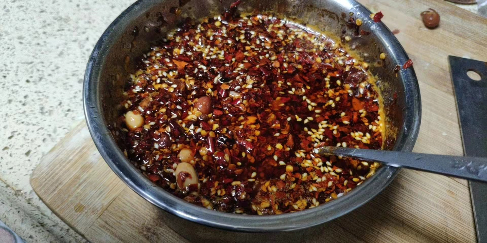

# How to Make Chili Oil (Youpo Lazhi)

Preparation Time: 10 minutes

Estimated cooking difficulty: ★★★

## Essential Ingredients and Tools

- Garlic
- Dried chili flakes
- Salt
- Roasted white sesame seeds
- Bird's eye chili
- Peanut oil (can be replaced with rapeseed oil)
- Small ceramic bowl
- Metal spoon
- Five-spice powder (optional)
- Tsaoko fruit (optional)
- Scallions (optional)
- Star anise
- Sichuan peppercorns
- Bay leaves
- Dahurian angelica root (Baizhi)
- Ginger slices (optional)
- Sugar
- White vinegar

## Calculation

- Garlic: 1 head
- Dried chili flakes: 100 grams
- Salt: 5 grams
- Roasted white sesame seeds: 15 grams
- Bird's eye chili: 1
- Peanut oil: 150 ml (can be replaced with rapeseed oil)
- Five-spice powder: 10 grams (optional)
- Tsaoko fruit: 1 (optional)
- Scallions: 3-5 (optional)
- Other spices: Star anise (1), Sichuan peppercorns (20-50, adjust to taste), Bay leaves (2-3), Dahurian angelica root (Baizhi) (2-3), Ginger slices (thick thumb-sized ginger, sliced) (optional)
- Sugar: 30 grams
- White vinegar: 5 ml (about one small metal spoonful)

## Instructions

- Take 2 small cloves of garlic and peel them.
- Take out a cutting board and mince the small garlic cloves and bird's eye chili.
- Take out a bowl and pour in the peanut oil.
- Heat the oil and add the other spices and scallions. Once the spices turn brown, remove and discard them.
- Take out a wok and transfer the oil from the bowl into it. Heat for 2 minutes (heat rapeseed oil until it smokes).
- At this point, the bowl should be empty.
- Add the dried chili flakes, white sesame seeds, minced garlic, bird's eye chili, salt, five-spice powder, and tsaoko fruit to the empty bowl as "seasonings".
- Turn off the heat and let the oil cool down to 210°C (410°F).
- Pour the hot oil from the wok into the bowl and stir well with a spoon (for extra spiciness, you can add another bowl of the same "seasonings" at 165°C (329°F) and mix them together at the end).
- After pouring in the hot oil, stir briefly and then add the white vinegar. It will start to sizzle again. Continue stirring; the white vinegar enhances the aroma.
- Once the chili oil has cooled to lukewarm, add the sugar and MSG (optional). Sugar can soften the spiciness and make it less pungent.

## Additional Information

- Adding five-spice powder and tsaoko fruit as "seasonings" can enhance the fragrance and make the chili oil more aromatic.

If you follow the production process in this guide and find any problems or processes that can be improved, please submit an Issue or Pull request.
