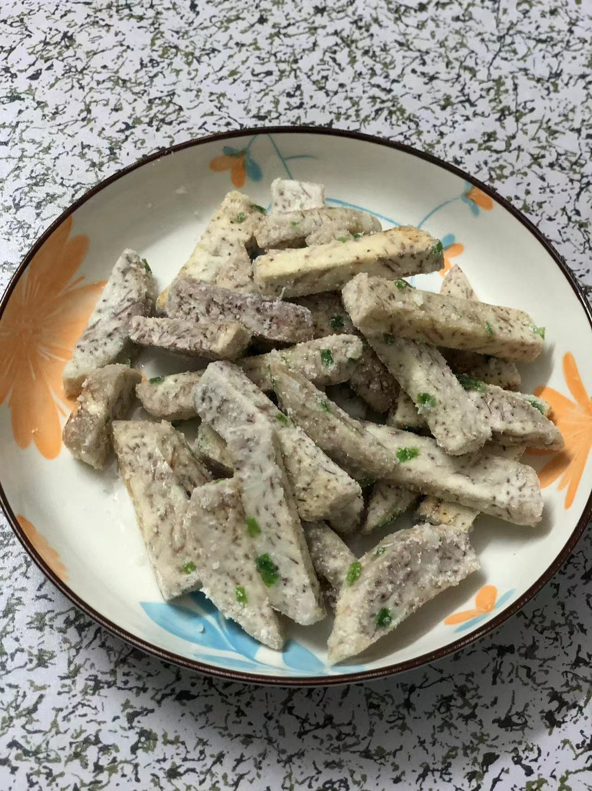

# How to Make Fried Taro (Fan Sha Taro)

Fried taro is a famous Chaozhou snack, perfect for afternoon tea, and it's particularly easy to make. Estimated preparation time: 20 minutes.

Estimated cooking difficulty: ★★★

## Essential Ingredients and Tools

- Lipu taro (can be purchased from e-commerce platforms, affordable and fresh)
- Granulated sugar or rock sugar
- Water
- Scallions

## Calculation

- Lipu taro: 200g
- Granulated sugar: 30g
- Water: 15g

## Instructions

1. Cut the taro into long strips (slightly thicker to prevent them from breaking during frying).
2. Add enough oil to submerge the taro and heat the oil (insert chopsticks; small bubbles should appear).
3. Place the taro into the oil and fry until they float, generally until they turn slightly yellow and can be easily pierced with chopsticks.
4. Save the oil used for frying the taro; it can be reused for cooking later.
5. Next, a key step: heat the sugar (30g) and water (15g) in a 2:1 ratio until it doesn't change color and small bubbles form.
6. Pour in the chopped scallions and taro, turn off the heat, and stir. As the temperature drops, the sugar will create a coating effect.
7. Serve on a plate!

## Additional Information

- The freshly made fried taro is very hot, so be careful not to burn your mouth.
- Pair it with tea for a truly delightful experience!

If you follow the production process in this guide and find any problems or processes that can be improved, please submit an Issue or Pull request.
