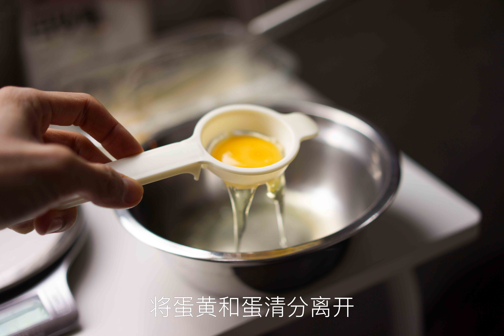
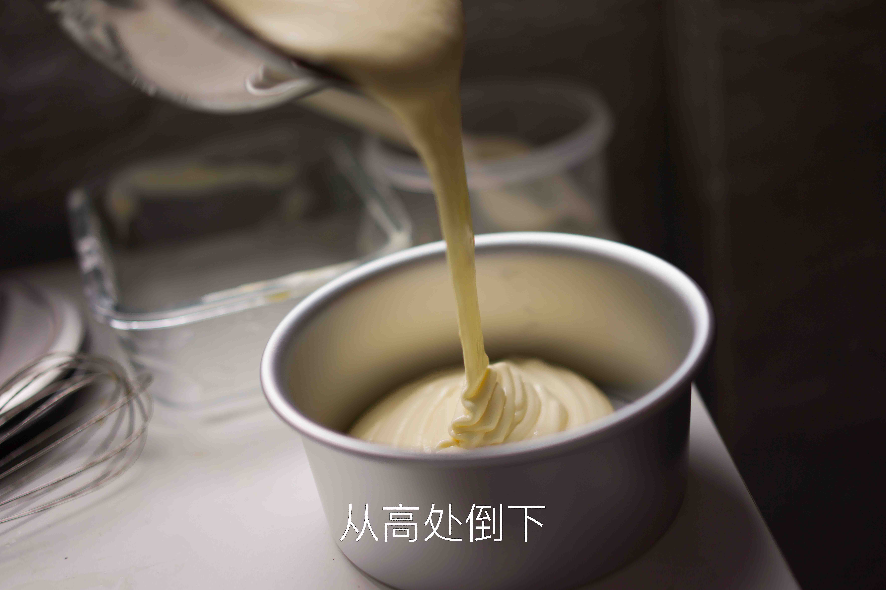

# How to Make Chiffon Cake

Chiffon cake is an introductory baking recipe with a certain level of difficulty. However, when made successfully, its texture is delicate and soft, leaving a lasting impression. Including baking time, it generally takes beginners **1.5 - 2 hours** to complete.

Estimated cooking difficulty: ★★★★★

## Essential Ingredients and Tools

### Tools

* Oven (rice cooker can be used as a substitute, but it is often prone to failure due to the material of the inner pot)
* Whisk (electric is best, manual is laborious and has a certain probability of failure) or chopsticks (not recommended)
* Aluminum alloy anodized mold (never choose a non-stick mold, common sizes are 6 inches or 8 inches)
* Spatula (for mixing the cake batter)

### Ingredients

- Eggs
- Granulated sugar
- Milk (or water)
- Cooking oil (or butter, but it needs to be heated and softened)
- Cake flour (recommended Huayi brand)
- [Optional] Lemon juice or white vinegar

## Calculation

Per serving (12 area units):

- 1 egg (normal medium size, about 50g)
- 16g granulated sugar
- 8g cooking oil
- 10g milk
- 17g cake flour

Specifically, for common 6-inch and 8-inch cakes:

* 6 inches: Size is 3 servings (i.e., three eggs). Area is 36 units.
  * 3 eggs, 50g granulated sugar, 25g cooking oil, 30g milk, 50g cake flour
* 8 inches: Size is 5 servings (i.e., five eggs). Area is 64 units.
  * 5 eggs, 80g granulated sugar, 40g cooking oil, 50g milk, 90g cake flour

## Instructions

### Preliminary Separation

* Remove fresh eggs from the refrigerator
* Prepare two containers and dry them, placing the egg whites and yolks separately
* The container for the egg whites can have a few water droplets, but **must not have any oil**; the container for the egg yolks must not have any water droplets
* Crack the eggs, manually or using an egg separator, and separate the egg whites and yolks into two containers.
* During separation, the egg yolks must not break, and **the egg whites must not be mixed with any egg yolk**, otherwise it will seriously affect whipping. (White strands can enter the egg whites without affecting whipping)
* (Note that if you are not using a kitchen machine, the container for the egg whites is also the whipping container. To avoid overflow, do not exceed **1/8** of the container after adding all the egg whites)

### Mixing the Egg Yolk Mixture

* Prepare a new empty bowl, add all the cooking oil, and then add the cake flour and mix
  * The oil will directly prevent the formation of gluten
* Add the egg yolks to the bowl, then add the milk and **1/4** of the granulated sugar, and mix well with a spatula
  * Although the milk added at this time contains water, it should not form gluten.
* Prepare the cake flour, and slowly sprinkle it into the container while mixing with a spatula in a "Z" shape, that is, the spatula can only move back and forth along the blade direction. **Do not stir counterclockwise or clockwise in a disordered manner**
* Continue, add all the flour, still using the above mixing method, until the mixture is uniform and there is no dry flour. (It is normal for some lumps to appear, and you can continue mixing to disperse them)
* Let stand, set aside

### Whipping the Egg Whites

* Prepare the remaining **3/4** of the granulated sugar. Divide it into three portions, each accounting for **1/4** of the total
* Add lemon juice or white vinegar to the egg whites (optional)
* Use a medium speed on the whisk to whip the egg whites until they have a *coarse, large bubble state*, add the **first portion of granulated sugar**
* Use a high speed on the whisk to whip the egg whites until they have a *fine bubble state*, add the **second portion of granulated sugar**
* Use a high speed on the whisk to whip the egg whites to a *“soft peak”* state (at this time, when the whisk head is lifted, there is a long, curved tip), add the **third portion of granulated sugar**
* Use a medium-low speed on the whisk to whip the egg whites to a "stiff peak" state (when the whisk head is lifted, there is a short, upright tip; when the container is inverted, the egg whites can stick to the container and not fall down)
* At this time, the degree of egg white whipping has met the requirements
  * (Refer to the pictures in the attached link for judging the state of the egg whites.)
  * The whisk should be as close as possible to the bottom of the container to prevent the surface from being whipped while the bottom remains liquid)

### Mixing and Stirring

* Simply stir the egg yolk mixture a few times
* Use a spatula to take **1/3** of the egg white meringue and add it to the egg yolk batter
* Use the "folding" technique to avoid defoaming
  * The folding technique is
  * First, use the spatula in your right hand to insert it into the bottom of the batter from the center of the mixing bowl
  * Scrape towards the 8 o'clock direction until you touch the bowl wall, then scoop up the batter and lift it into the air, then move it back to the center of the bowl and put the batter into the bowl
  * Hold the mixing bowl with your left hand and turn it from 9 o'clock to 7 o'clock, rotating exactly 60 degrees, completing one cycle
  * The speed is about two strokes per second
  * This method comes from "Ms. Kojima's Cake Classroom". In layman's terms, it is like stir-frying.
* Pour the mixture of **1/3** of the egg white meringue and egg yolk mixture into the remaining **2/3** of the egg white meringue, and continue to fold evenly
* Pour the cake batter into the mold and shake it a few times to avoid large air bubbles

### Baking

* Total baking time: 6-inch cake **30-35** minutes, 8-inch cake **50** minutes. Adjust flexibly according to the characteristics of your oven, generally not exceeding $\pm 5$ minutes. (Observe in front of the oven during the last few minutes)
* Preheat the oven with the **upper tube at **150** degrees Celsius and the lower tube at **160** degrees Celsius** for about 10 minutes to reach the set temperature.
* After preheating, place the mold on the lower layer of the oven
* Choose **variable temperature baking**, divided into two stages.
  * In the first stage, set the oven temperature to: upper tube **150** degrees Celsius, lower tube **160** degrees Celsius;
  * The first **3/5** of the total baking time is the first stage of baking
  * The second stage temperature is: upper tube **160** degrees Celsius, lower tube **170** degrees Celsius;
  * The last **2/5** of the total baking time is the second stage of baking. Simply adjust the oven temperature to switch.
* After baking, take it out of the oven
  * This operation may be **hot**, so be careful to use a towel for assistance

### Cooling and Demolding

- (Optional) Drop the mold from a high place to shake out the heat
- Invert the mold for 10 minutes to cool the cake
  - Demolding the cake immediately without cooling will damage the cake
  - This operation may be **hot**, so be careful to use a towel for assistance
- Demold and serve

## Additional Information

- Referenced the following tutorial, which explains very detailed and has pictures for each step. At the same time, it explains why a certain operation is performed, the principles behind it, and the analysis of certain problems:
- [In order to make this chiffon cake well, I used a whole box of eggs, and since then I have said goodbye to concave bottoms and collapses](https://zhuanlan.zhihu.com/p/86865919)
- For chiffon cake, egg white whipping is a secondary issue, the key is **the temperature and time during baking**.
- For egg white containers, there can be water droplets, but egg yolk containers cannot.
  - Reason: Oil will affect the whipping of egg whites, and egg whites are 85% water, so a few water droplets will not affect whipping.
  - Particularly fresh egg whites will be harder. To deal with hard egg whites, add 15ml of water to a 5-egg recipe to help whip the egg whites (3g of water for a 1-egg recipe)
- The sugar added during egg white whipping actually first dissolves in the water in the egg whites, becoming a sugar syrup solution that wraps around the bubbles, protecting the whipped bubbles.
- Temperature has a greater impact on the rate at which sugar dissolves in water and its solubility. Egg whites that have just been taken out of the refrigerator are not easy to whip. However, it is easier to separate egg whites and yolks at lower temperatures, so it is recommended to restore to room temperature before whipping after separation.
- Some reference pictures

  

  

  

  

  

  

  

  

  

如果您遵循本指南的制作流程而发现有问题或可以改进的流程，请提出 Issue 或 Pull request 。
