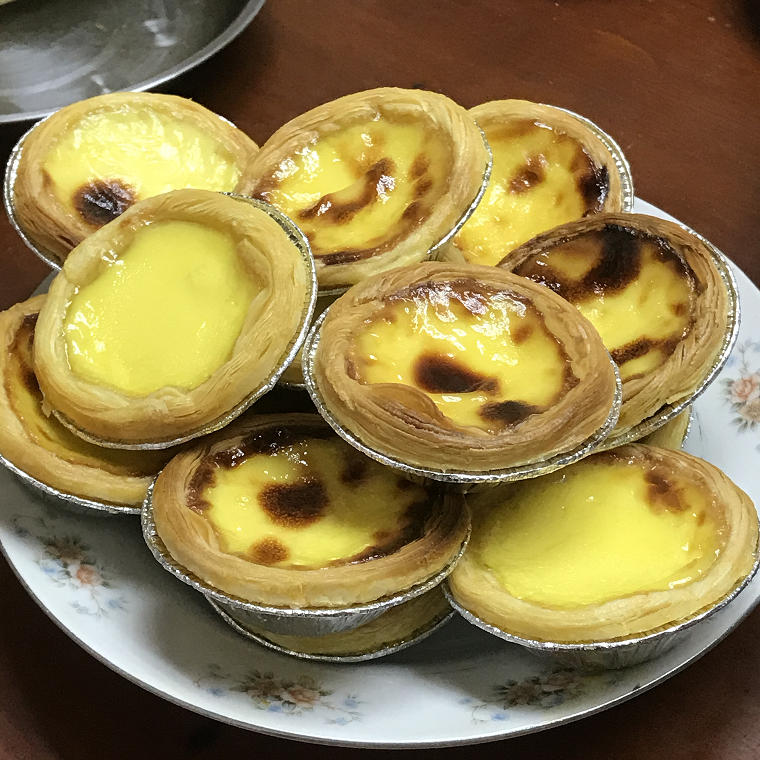

# How to Make Baked Egg Tarts

Baked egg tarts are a simple and easy-to-make dessert, and the semi-finished product can be stored in the refrigerator for a long time. Take them out and eat them at any time. The production time is about 1 hour.

Estimated cooking difficulty: ★★★★

## Essential Ingredients and Tools

This recipe is the amount needed for a whole package of egg tart skins. After filling, it can be directly frozen for storage.

- Egg tart skins (brand is not limited)
- Eggs
- Milk
- Heavy cream
- Granulated sugar
- Oven (size is not limited)
- Gram scale
- Mixer (including but not limited to chopsticks, whisks, and other tools)
- Sieve with a mesh size of about 1 mm

## Calculation

Per serving:

This recipe is the amount needed for a whole package of egg tart skins. After filling, it can be directly frozen for storage.

- Egg tart skins (brand is not limited, a whole package of egg tart skins is about 30 pieces)
- Eggs 8 (ordinary eggs are fine)
- Milk 200 ml (ordinary bagged milk is fine)
- Heavy cream 450 ml (available in baking shops or supermarkets)
- Granulated sugar 80 grams (ordinary sugar is fine, fine sugar is better and easier to melt)

## Instructions

- Place the bowl on a gram scale and weigh 450 grams of heavy cream (the density of heavy cream is recorded as 1 here)
- Add 80 grams of granulated sugar (medium sweetness, can be increased or decreased according to personal taste, the recommended range is 60-100 grams)
- Add 200 grams of milk (the density of milk is recorded as 1 here)
- Take 8 egg yolks and add them, the egg whites can be kept for other uses
- Stir all the ingredients evenly until all the granulated sugar is completely melted
- Use a mesh sieve to filter the stirred ingredients to remove egg membranes, eggshells, unmelted granulated sugar, and caked heavy cream
- At this time, please set the oven to 220 degrees Celsius and start preheating (about 10 minutes). Remember to take out the baking tray
- Place the egg tart skins evenly on the baking tray with a spacing of 0.5 cm
- Pour the filtered ingredients into the egg tart skins, the liquid level should be 0.5 cm from the upper edge of the egg tart skin, not too much
- Up to this step, the production of semi-finished egg tarts has been completed and can be directly placed in the refrigerator for quick freezing and stored for more than 12 hours
- Place the semi-finished egg tarts in the oven for baking at a temperature of 200 degrees Celsius for 25 minutes
- It can be eaten after baking

## Additional Information

When operating, please be careful of the high temperature of the oven to prevent burns

If you follow the production process in this guide and find any problems or processes that can be improved, please submit an Issue or Pull request.
