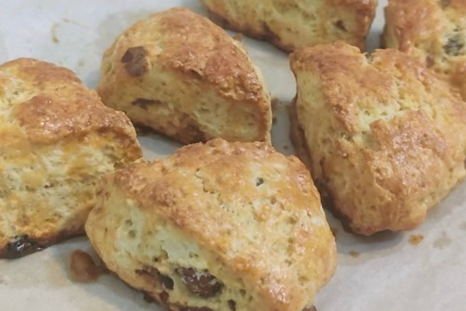

# How to Make English Scones

English scones are a very simple and quick afternoon tea dessert that can be served with jam, tea, and coffee. The finished product has a flavor based on egg and milk aroma, and the amount of sugar is moderate and not too sweet.

Estimated cooking difficulty: ★★★

## Essential Ingredients and Tools

- Unsalted butter (recommended brand President)
- Cake flour
- Sugar
- Salt
- Baking powder
- Eggs
- Heavy cream
- Cream cheese (optional)

## Calculation

Before each production, you need to determine how many servings you plan to make. One serving is just enough for 4-6 people.

Per serving:

- Unsalted butter 40g
- Cake flour 180g
- Sugar 30g
- Salt 1g
- Baking powder 5g
- Eggs 1 (about 50g)
- Heavy cream 45g
- Cream cheese 50g

## Instructions

- Beat the eggs, weigh out 30g of egg liquid and put it in a clean container, add all the heavy cream and cream cheese and mix well. If the cheese is too hard, you can heat it in a water bath to about 40 degrees before mixing.
- Put the cake flour, salt, sugar, and baking powder in a clean container and mix well
- Cut the butter into small pieces, put it into the mixture in the previous step, and use your hands to knead the butter into the mixture until it has a coarse cornmeal texture
- Pour the egg and milk mixture from the first step into the flour and oil mixture obtained in the previous step, and stir until nearly even. Stack and press into a uniform dough
- Place the dough on a cutting board, roll it into a 1.5cm thick sheet, and cut it into suitable shapes with a knife or mold
- Dip the remaining 20g of egg liquid with a brush and brush it on the surface of the scones
- Preheat the oven to 180 degrees and bake for 27 minutes

## Additional Information

- The simplest cutting plan is to roll it into a circular dough and cut it into 6 fan shapes

If you follow the production process in this guide and find any problems or processes that can be improved, please submit an Issue or Pull request.
