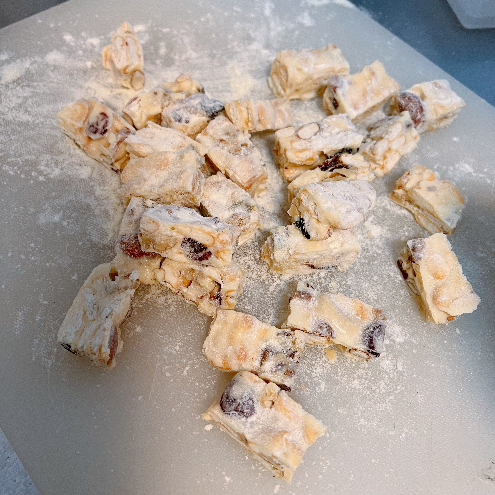

# How to Make Snowflake Crisp

Snowflake crisp is a quick and easy dessert, suitable for boxing and gifting, and takes 30 minutes to make.

Estimated cooking difficulty: ★★★

## Essential Ingredients and Tools

### Tools

- Non-stick pan
- Baking spatula (can be replaced with a spatula, be careful to use it to damage the non-stick pan coating)
- Disposable plastic gloves
- Snowflake crisp/nougat mold
- Rolling pin

### Ingredients

- Unsalted butter
- Marshmallows
- Whole milk powder
- Mixed nuts (Three Squirrels Daily Nuts)
- Biscuits (non-sandwich biscuits, recommended Xiao Qifu or purchase snowflake crisp baking special biscuits)

## Calculation

Per serving:

- Unsalted butter 20g
- Marshmallows 75g
- Whole milk powder 40g
- Mixed nuts 60g
- Biscuits 75g

## Instructions

- If the biscuits are larger than a one-yuan coin, cut them into small pieces first
- Add unsalted butter to the pot and heat over low heat until the unsalted butter is completely melted
- Add the marshmallows to the pot and stir with a spatula until the marshmallows are melted and evenly mixed with the unsalted butter
- Add 20g of milk powder to the pot and stir with a spatula. After the milk powder is evenly mixed with the butter marshmallow mixture, turn off the heat immediately
- Add all the prepared mixed nuts and biscuits to the pot while it is hot, and stir with a spatula
- After stirring until the temperature drops to a temperature that the hand can touch, put on disposable plastic gloves, rub in the pot or pick up and pull with both hands to evenly disperse the biscuit mixed nuts and marshmallow butter milk powder mixture.
- Press the above mixture into the mold, compact the corners, flatten with a rolling pin, and press the unfilled side into a straight edge as much as possible by hand
- Let cool at room temperature, demould completely after cooling, cut into pieces according to the mold pattern, or cut into your favorite size, sprinkle with the remaining milk powder, and try to make each side of the snowflake crisp stick to the milk powder

## Additional Information

- The longer the marshmallows are heated, the harder the final product will be
- Reference: [【One Small Pot, Ten Minutes to Get the Net Red Strawberry "Snowflake Crisp" - Bilibili】](https://b23.tv/P547ILO)

If you follow the production process in this guide and find any problems or processes that can be improved, please submit an Issue or Pull request.
