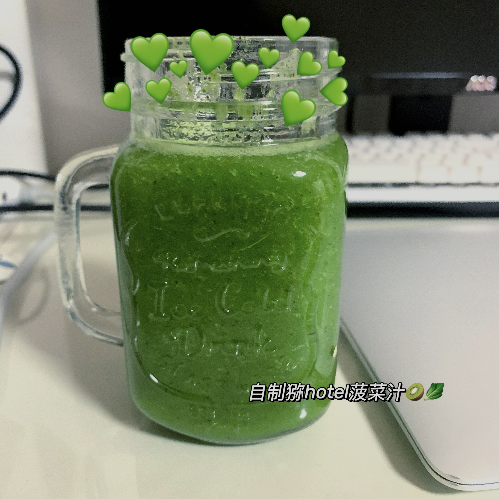

# How to Make Kiwi Spinach Special

Estimated cooking difficulty: ★

## Essential Ingredients and Tools

- Ingredients:
  - Kiwi
  - Apple
  - Spinach leaves (2-5 leaves)
  - Water
  - Granulated sugar
- Tools
  - Juicer

## Calculation

- Drinking water 700ml
- Kiwi 2
- Apple 1/2
- Spinach leaves 4
- Granulated sugar 12 grams

## Instructions

- Cut the kiwi in half, and then divide each half into four small pieces
- Dice the apple
- Remove the stems from the spinach leaves, leaving only the leaves
- Chop the spinach
- Pour all into the juicer mixing cup
- Add water
- Add granulated sugar
- Start the juicer and stir for about 4 15 seconds (stop every 15 seconds to check the status)

## Additional Information

- About the amount of granulated sugar: full sugar is 12g, which can be adjusted between 0-12g according to personal preference
- This product is imitated from IKEA's kiwi spinach juice. It is not as good as IKEA's, but it is not bad
- Welcome to improve!

### Finished product

If you follow the production process in this guide and find any problems or processes that can be improved, please submit an Issue or Pull request.
