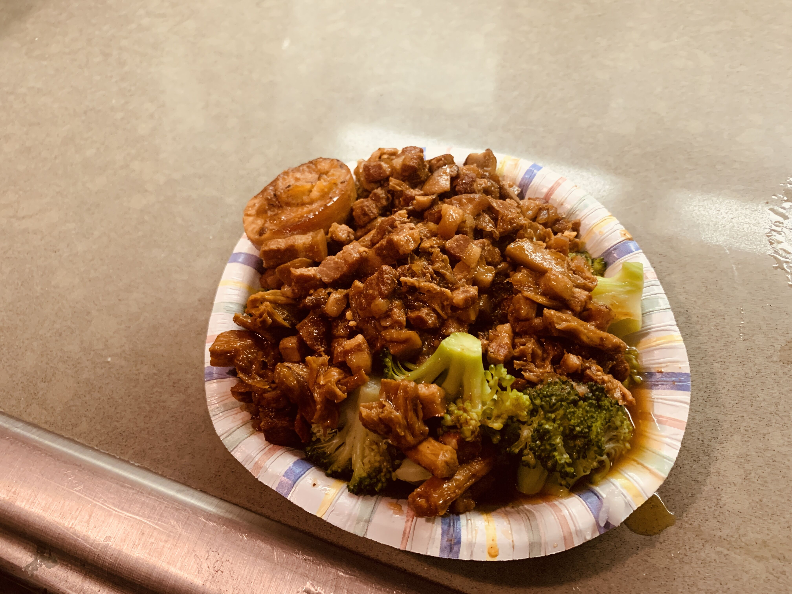
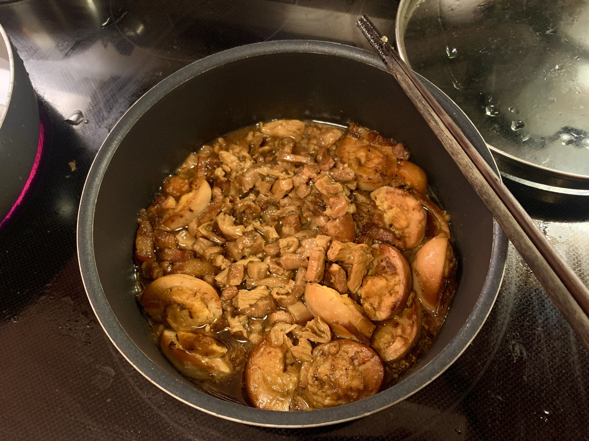
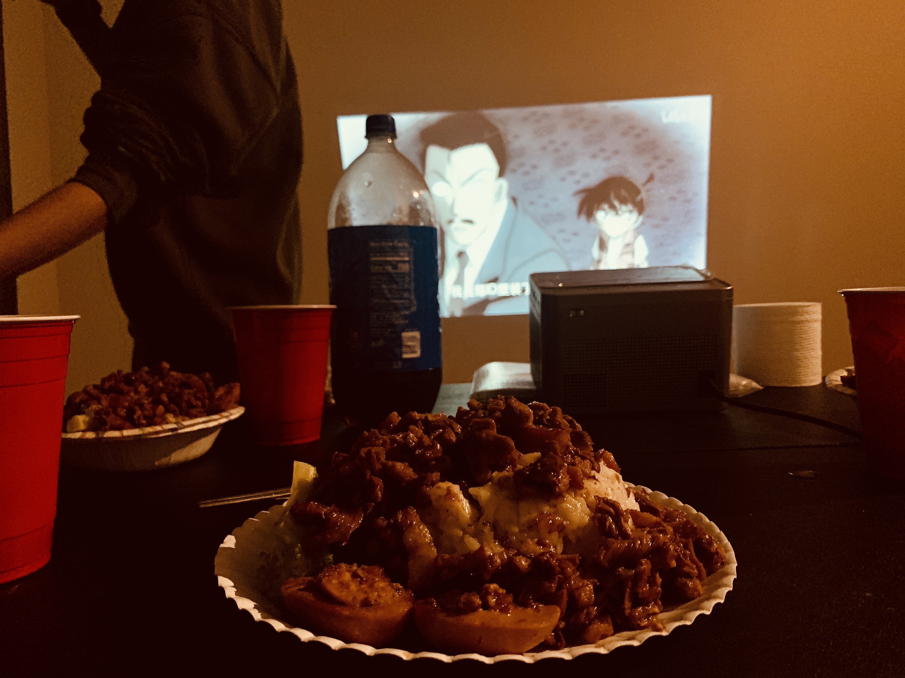

# How to Make Taiwanese Braised Pork Rice

Sugar and fat are the source of human happiness. Taiwanese braised pork rice, rich in both, can bring a soul-stirring satisfaction with every bite.

This article provides a simple but flavorful Taiwanese braised pork rice recipe, with an estimated preparation time of 4 hours (0.5 hours of operation, 3.5 hours of stewing).

Kitchen novices can get started.

Estimated cooking difficulty: ★★★★★

## Essential Ingredients and Tools

- Original cola (sugar-free cola cannot be used)
- Fried shallots (optional, but highly recommended)
- Onion
- Pork belly with skin
- Light soy sauce
- Oyster sauce (optional)
- Striped dried bean curd (optional, but highly recommended, dried bean curd can greatly enhance the flavor)
- Eggs (optional)
- Broccoli (optional, can also be replaced with other vegetables)
- Beer
- Cooking wine (for removing fishy smell)
- Thirteen spice powder
- Mushrooms
- Rice

## Calculation

Before each production, you need to determine how many servings you plan to make. One serving can serve 4 braised pork rice set meals in fast food restaurants.
Per serving:

- Original cola 250ml
- Fried shallots 5g (can be added arbitrarily according to personal preference)
- Onion $\frac{1}{4}$
- Pork belly with skin 500g
- Light soy sauce 25ml($\pm$5ml)
- Oyster sauce 5ml
- Striped dried bean curd 5 (can be added arbitrarily according to personal preference)
- Eggs 4 (you can change the number of eggs at will)
- Broccoli 300g (can be modified arbitrarily according to personal preference)
- Cooking oil 10-15ml
- Beer 100ml
- Cooking wine 5ml
- Thirteen spice powder 10g
- Mushrooms 3
- Rice (determined according to personal food intake)

## Operation

- Open the cola and let it vent, otherwise a lot of foam will be generated in the pot later
- Cut the pork belly with skin into thin strips of $0.7cm（length）\times 0.7cm（width） \times 2.5cm（height）$

- Cut the onion into small pieces for later use.
- Dice the mushrooms for later use
- Cut the dried bean curd into sections for later use
- Boil the eggs, peel them, and cut the protein with a knife (to make it easier to taste), set aside.
- Heat the pot over **high heat**, add 10ml - 15ml of cooking oil to the pot, so that the oil slides over the bottom of the pot. The purpose of adding oil is to prevent the pork belly from sticking to the pot when it is first put in. Wait 5s for the oil temperature to rise slightly.
- Put in the pork belly strips and stir-fry until the meat turns slightly white, pour in 5ml of cooking wine along the side of the pot. Continue to stir-fry until the pork belly no longer produces oil. Remove the semi-cooked pork belly to drain the oil and set aside. **Do not wash the pot**.
- Put the chopped onion pieces and mushroom cubes into the pot and stir-fry for 1 minute to release the aroma
- Put the pork belly back into the pot and continue to stir-fry for 1 minute until evenly stir-fried.
- Add beer to $\frac{1}{3}$ of all meat strips, continue to stir-fry for 2 minutes until the wine is gone.
- Add original cola until it **just covers all the meat strips**, add 25ml of light soy sauce, 5ml of oyster sauce, 5g of fried shallots, and 10g of thirteen spice powder, stir well.
- After boiling, turn to **medium heat**, add dried bean curd sections, cooked eggs, stir well, cover and simmer.
- After simmering over medium heat for **30 minutes**, turn to **low heat** and continue to simmer covered for **3 hours**
  - During the low heat simmering process, stir and check every **30 minutes** to prevent sticking to the pot.
  - If it is found to be too dry, you can add 100ml of clear water and continue to simmer.
- After the simmering is over, take a bowl of rice, pour the soft and glutinous braised pork on the rice, and add braised eggs and broccoli to start enjoying.

## Additional content

- For the pork belly cutting step, definition: Place the pork belly with the skin facing up on the table. At this time, the plane where the pork skin is located is the plane formed by the length and width, and the one perpendicular to this plane is the height. The final effect of the meat strips is slender strips with alternating fat and lean meat. (Note: The meat strips must be thin here, that is, the length and width are small. Thin meat strips are easier to stew until soft and glutinous).
- Small tips for cutting pork belly strips:
  - If the pork belly is **not frozen**, you can put it in the **freezer for 30 minutes** and then take it out to cut into strips.
  - If it is **frozen pork belly**, you can leave it at **room temperature** for **30 minutes** and then cut it into strips.
  - When cutting strips, you can quickly rub the blade against the meat with less force, which makes it easier to cut and protects the fat and lean structure of the pork belly.
- The role of cola here is **only to color and provide sweetness**, not the main source of flavor. **Do not add too much cola**, otherwise the finished product will be too sweet.
- Beer can give the meat a malt flavor and relieve greasiness.
- Reference materials: [No need to add a drop of water! Lazy people! Cola Braised Pork Rice!](https://www.bilibili.com/video/BV1kA4y1D7vT)

If you follow the production process in this guide and find any problems or processes that can be improved, please submit an Issue or Pull request.
