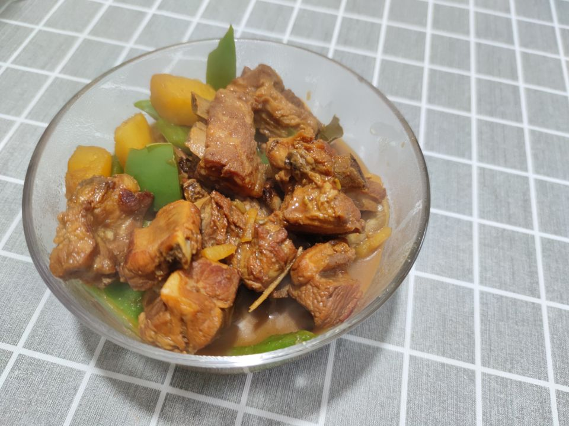
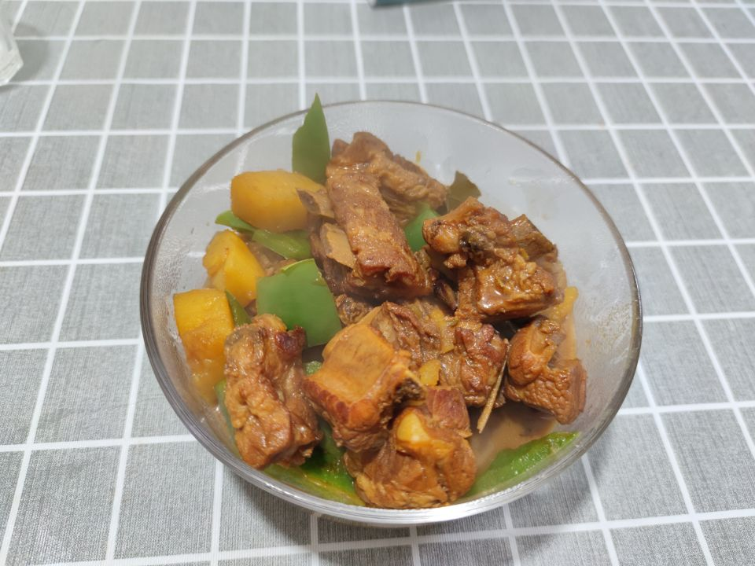

# How to Make Potato Stewed Ribs

Estimated cooking difficulty: ★★★

## Essential Ingredients and Tools

- Ribs
- Potato
- Ginger
- Small onion
- Cooking wine
- White sugar
- Dried chili
- Star anise
- Pepper
- Cinnamon
- Light soy sauce
- Dark soy sauce
- Oyster sauce
- Yellow bean sauce

## Calculation

- Ribs = 750g
- Potato = 300g
- Ginger = 30g
- Small onion = 25g
- Cooking wine = 25g
- White sugar = 10g
- Dried chili = 5g
- Star anise = 5g
- Pepper = 5g
- Cinnamon = 5g
- Light soy sauce = 10g
- Dark soy sauce = 5g
- Oyster sauce = 5g
- Yellow bean sauce = 5g

## Operation

- Cut two potatoes into pieces, and slice the ginger
- Put 750g of ribs in a pot with cold water, add ginger slices, green onion sections, and cooking wine to blanch for 2 minutes, take out and wash it clean after draining the water (be sure to use hot water, not cold water)
- Heat the pot with cold oil, pour white sugar into the pot, and stir-fry until it melts into caramel color
- Add the ribs and fry until golden brown on both sides, so that the ribs are covered with caramel
- Add dried chili, star anise, pepper, cinnamon, ginger slices (it is recommended to buy spice packets from the supermarket), 10ml light soy sauce, 5ml dark soy sauce, 5ml cooking wine, 5ml oyster sauce, 5ml yellow bean sauce
- After stir-frying evenly over high heat, add 700ml of boiling water, bring to a boil over high heat, then turn to low heat and simmer for 1 hour
- Finally, add the potatoes and cook for 10 minutes before serving (you can also add green and red peppers according to your preference)
- 
- 

## Additional content

This dish is simple and easy to make, beginner-friendly, and super delicious

If you follow the production process in this guide and find any problems or processes that can be improved, please submit an Issue or Pull request.
