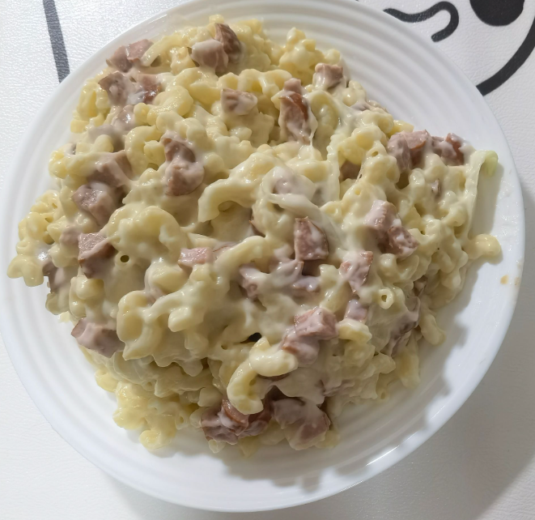

# How to Make Mac and Cheese with Bacon

This is a delicious Mac and Cheese with Bacon, suitable for four people. It combines rich cheese and crispy bacon, is simple and easy to make, and is a popular American home-cooked dish.

Estimated cooking difficulty: ★★★

## Essential Ingredients and Tools

- Macaroni
- Cheese
- Meat
- Onion
- Butter
- Flour
- Milk
- Garlic

## Calculation

Before each production, you need to determine how many servings you plan to make. One serving is enough for 2 people.

- Macaroni 100-125g
- Cheese 40-55g, prepare an extra 25g for baking, in strips
- Bacon or other meat 100-125g
- Onion 25g-40g, chopped
- Butter 15g
- Flour 10g
- Milk 125ml
- Half a clove of garlic, minced

## Operation

- Grate the cheese
- Cut the onion into strips
- Boil the macaroni in slightly salty water for 6 minutes
- **Medium heat**
- Put butter in the pot and wait for it to melt
- Add onion
- Add garlic after the onion softens
- After the garlic is fragrant, add the meat and wait for 5 seconds
- **Low heat**
- Add milk four times, stirring for 5 seconds each time before adding the next time
- Add flour and stir well
- Add cheese and stir well
- Mix the macaroni and cheese
- If you don’t plan to bake it, you can eat it directly
- **Baking:**
- Preheat the oven to 180°C
- Spread an extra 50g of cheese on top of the macaroni
- After the oven is preheated to 180°C, put the macaroni in
- Bake until golden brown on the surface, about 24 minutes

## Additional content

This dish is very unhealthy, with about 1300 calories and 80g of fat. It is not recommended to eat it often.

If you follow the production process in this guide and find any problems or processes that can be improved, please submit an Issue or Pull request.
