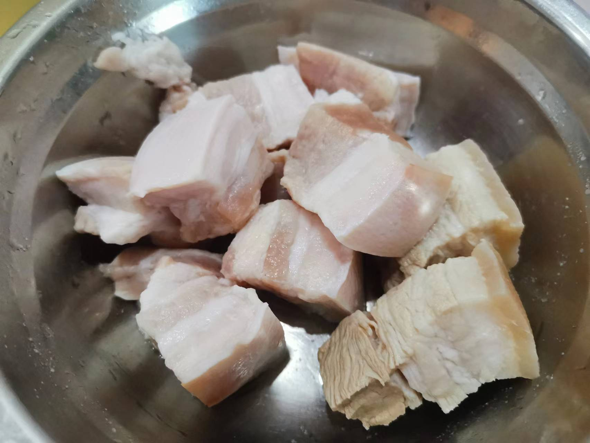

# How to Make Anhui Braised Pork

Anhui-style braised pork is a dish made with pork belly and other ingredients.

Estimated cooking difficulty: ★★★★

## Essential Ingredients and Tools

* Pork belly
* White sugar
* Cooking oil
* Light soy sauce
* Oyster sauce
* Dark soy sauce
* Ginger slices
* Garlic
* Cooking wine
* Green onion
* Five-spice powder
* Salt

## Calculation

Per serving:

* Pork belly 300 g
* White sugar 100 g
* Cooking oil 200 g
* Light soy sauce 10 ml
* Oyster sauce 5 ml
* Dark soy sauce 5 ml
* Ginger slices 2
* Garlic 3
* Cooking wine 100 ml
* Green onion 1
* Five-spice powder 10 g
* Salt 10 g

## Operation

* Cut the pork belly into pieces, each piece about 2-3 cm in size
* Add 150 ml of cooking oil to the pot, pour in the pork belly and fry for 2 minutes, then add salt, stir-fry the pork belly, take it out of the pot after 2 minutes
* Add 50 ml of cooking oil to the pot, pour in white sugar, and stir-fry until it turns coffee color
* Pour in the pork belly, stir-fry for 30 seconds, add ginger slices and garlic and stir-fry for 30 seconds
* Add cooking wine, five-spice powder, green onion, add water to submerge the pork belly, cover the pot and cook for 10 minutes
* Add light soy sauce, dark soy sauce, oyster sauce, and cook over medium heat for 20 minutes
* Open the pot, bring the juice to a boil over high heat, and serve

## Additional content

* The green onion is whole, no need to chop it
* The purpose of adding salt in step 2 is to lock in the fat of the pork belly
* During the production process, some of the pork belly was blanched, and the subsequent production was done together with the untreated pork belly. It was found that the untreated meat was more Q-elastic

If you follow the production process in this guide and find any problems or processes that can be improved, please submit an Issue or Pull request.
