# How to Make Chu Hou Beef Brisket

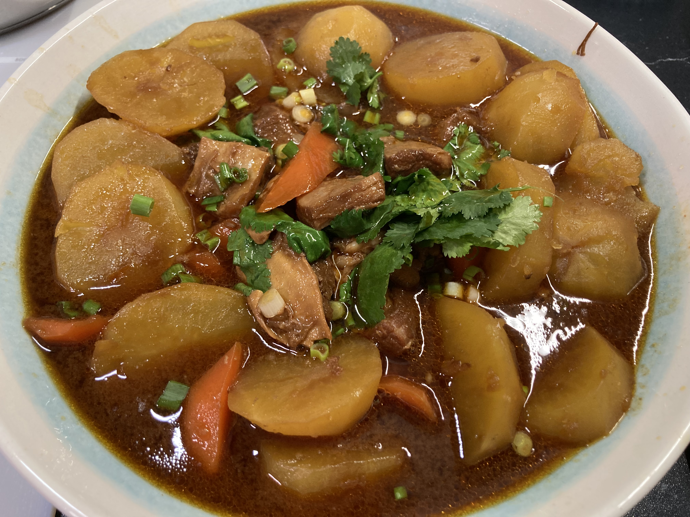
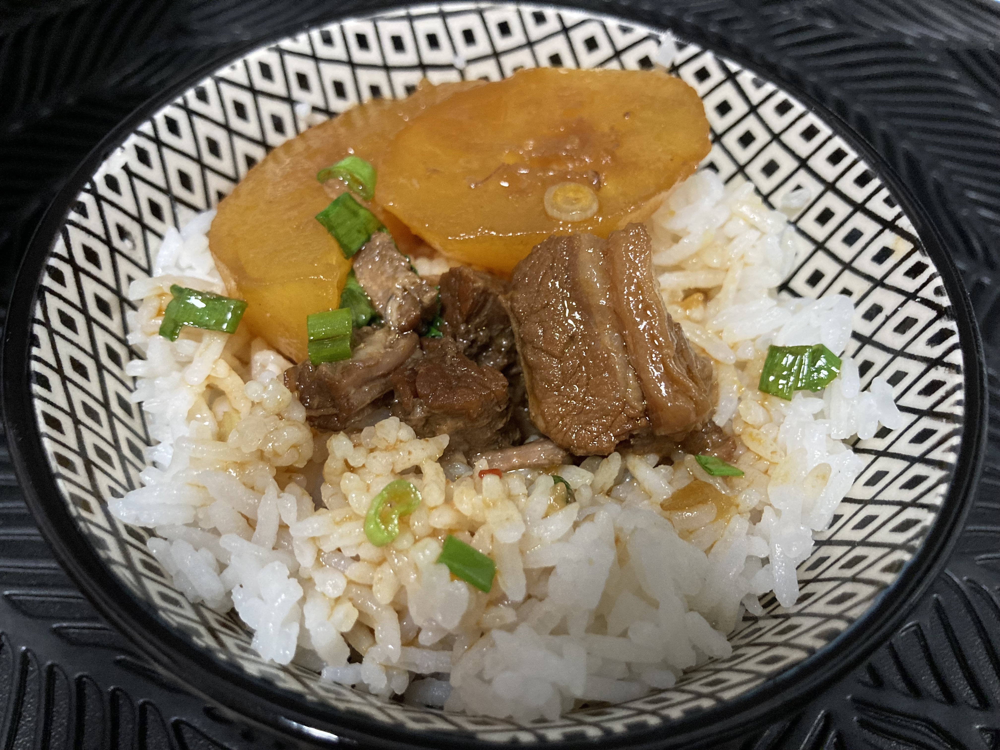

The meat is fragrant and delicious, the color is attractive, nourishing and strengthening, the taste is excellent, and it is a mouthwatering Cantonese dish. It only takes 1 hour with a pressure cooker, otherwise it takes 3 hours to simmer.

Estimated cooking difficulty: ★★★★

## Essential Ingredients and Tools

- Stew pot, pressure cooker (optional, but highly recommended!)
- Beef brisket (preferably brisket with tendons)
  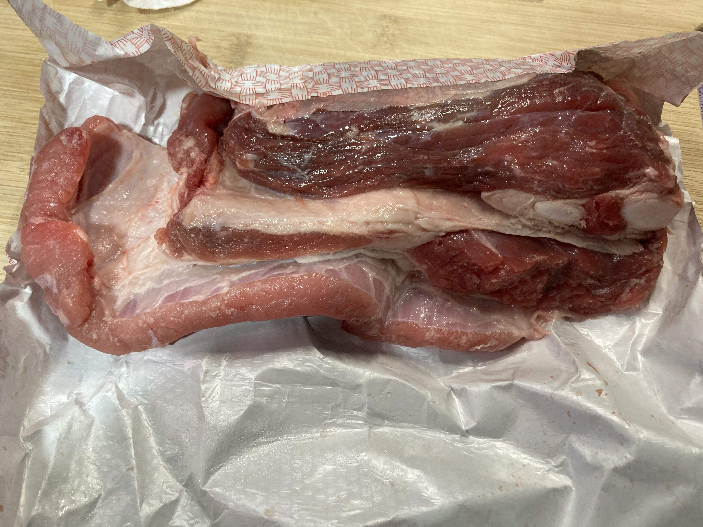
- Chu Hou paste (core sauce), Pixian Doubanjiang, fermented bean curd, char siu sauce (optional), oyster sauce, dark soy sauce, light soy sauce
- Shaoxing wine, white wine
- Bay leaves, Sichuan peppercorns, star anise, dried chili peppers, cloves, licorice, dried chili peppers, small hot peppers (optional), ginger, garlic

## Calculation

The following is the amount for two people:

- Beef brisket 500-600g
- Ginger 30g
- Garlic half a head
- Small hot peppers 1 (adjust the amount according to taste)
- Bay leaves 2
- Sichuan peppercorns 0.5g
- Star anise 2
- Dried chili peppers 3 (adjust the amount according to taste)
- Cloves 3
- Licorice 2 slices
- Red fermented bean curd 2 pieces
- Pixian Doubanjiang 15g
- Rock sugar 10g
- Shaoxing wine 10g
- White wine 20g
- Chu Hou paste 50g
- Oyster sauce 20g
- Dark soy sauce 5g
- Light soy sauce 60g
- Char siu sauce 20g

## Operation

- First prepare the accessories:

  - Bowl 1: Cut ginger into 1.5cm*1.5cm small pieces, peel half a head of garlic, and cut small hot peppers into 1cm small sections if you have them
    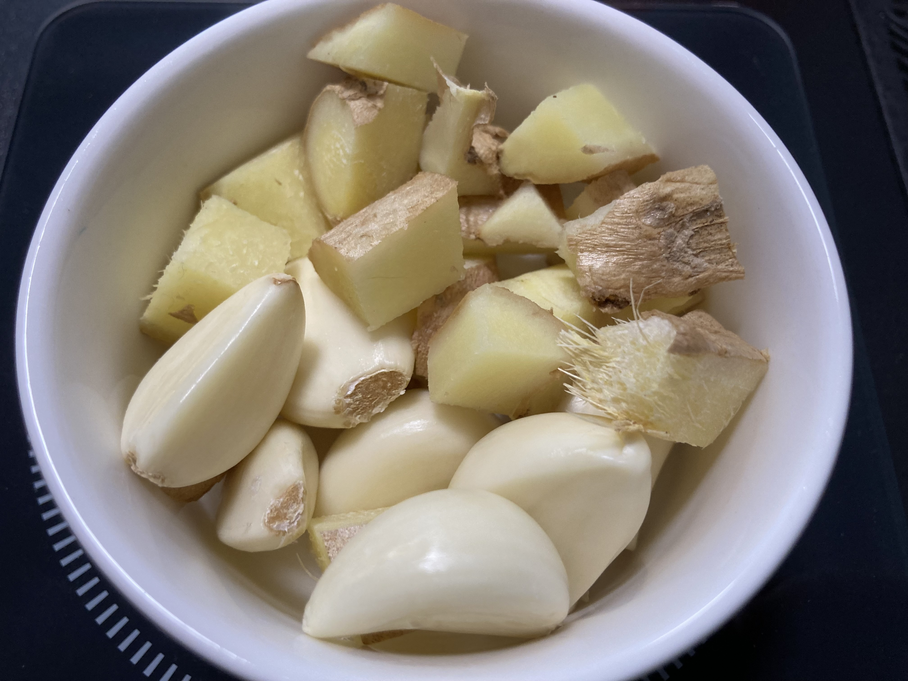
  - Bowl 2: Put in 2 bay leaves, 0.5g Sichuan peppercorns, 2 star anises, 3 dried chili peppers, 3 cloves, 2 slices of licorice
    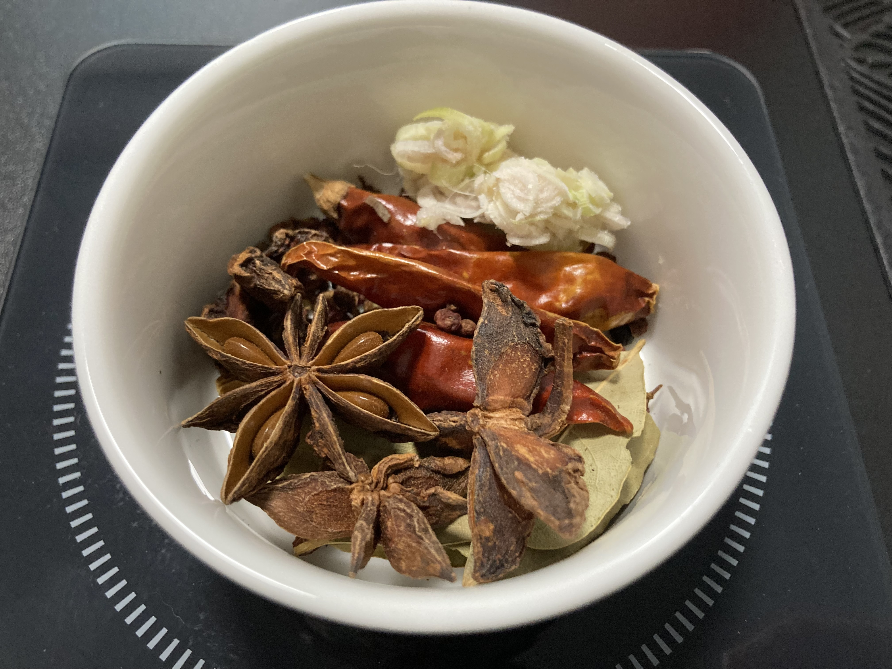
  - Bowl 3: Put in 2 pieces of red fermented bean curd
    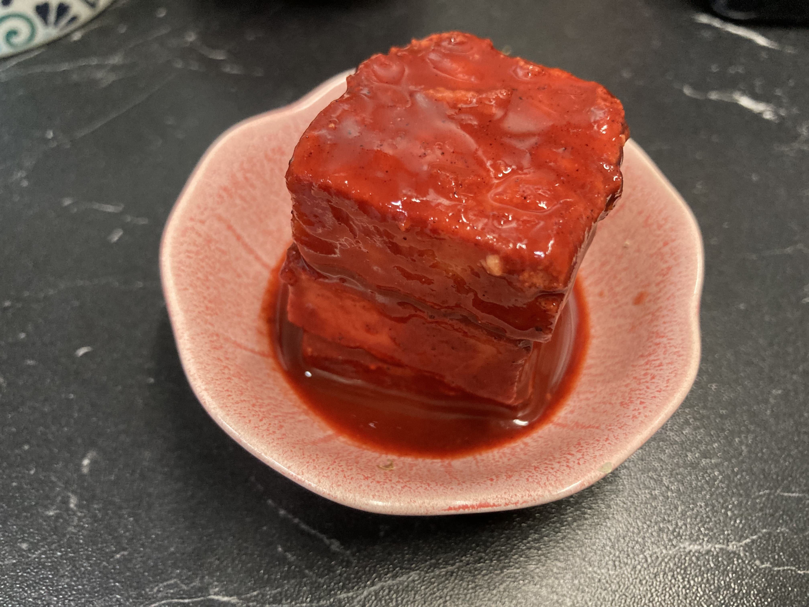
  - Bowl 4: Put in 15g of Doubanjiang
    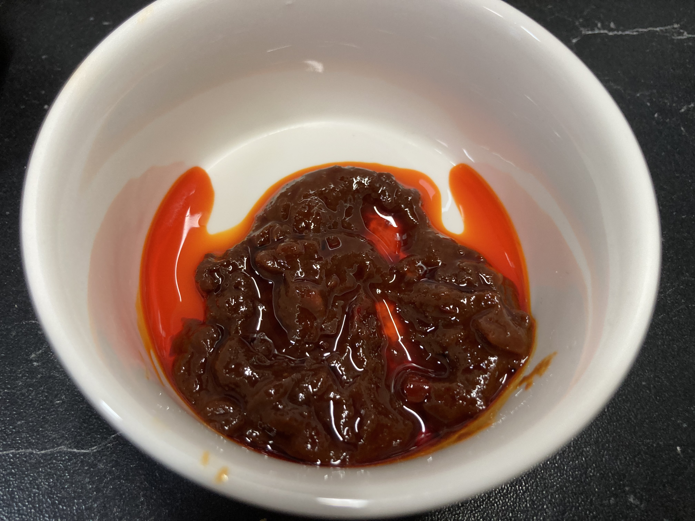
  - Bowl 5: Put in 10g of rock sugar
    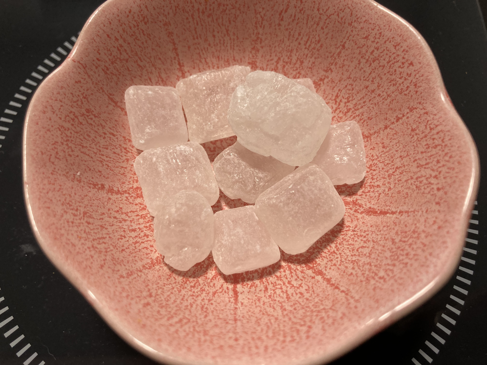
  - Bowl 6: Pour in 10g of Shaoxing wine and 10g of white wine
    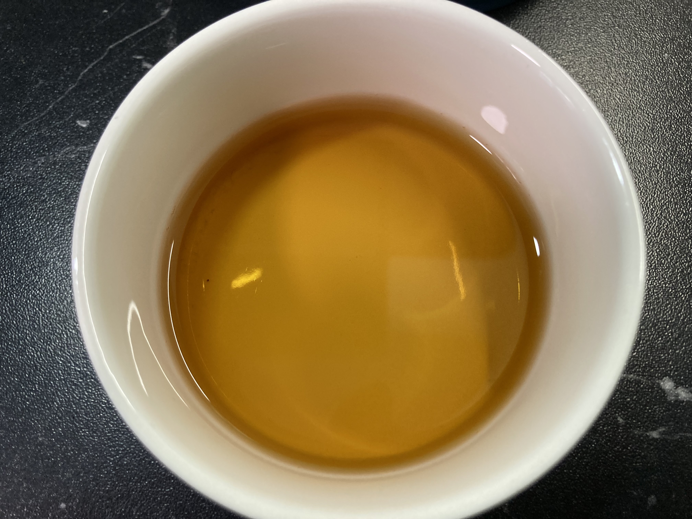
  - Bowl 7: Add 50g of Chu Hou paste, 20g of oyster sauce, 20g of char siu sauce, 5g of dark soy sauce, and 60g of light soy sauce
    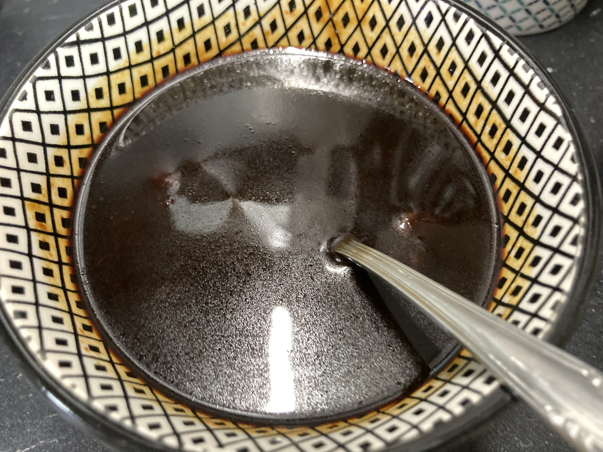

- Do not cut the beef, put it directly into the pot with cold water, bring to a boil over high heat, and take out the beef when the water boils
  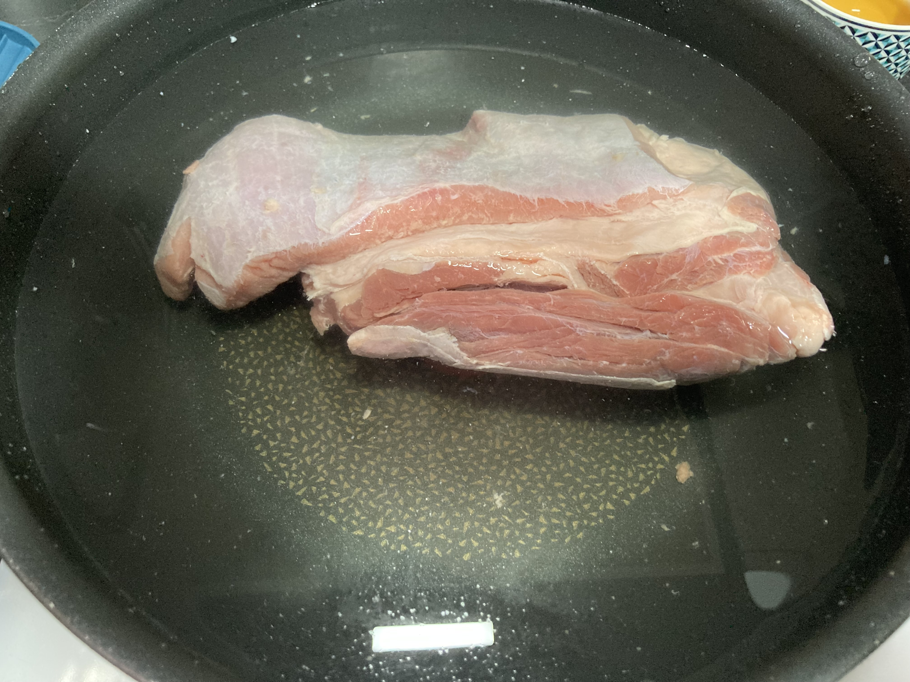
- Rinse the impurities on the surface of the beef, cut into 4cm*4cm*4cm large pieces, drain the water and put it in a bowl for later use
  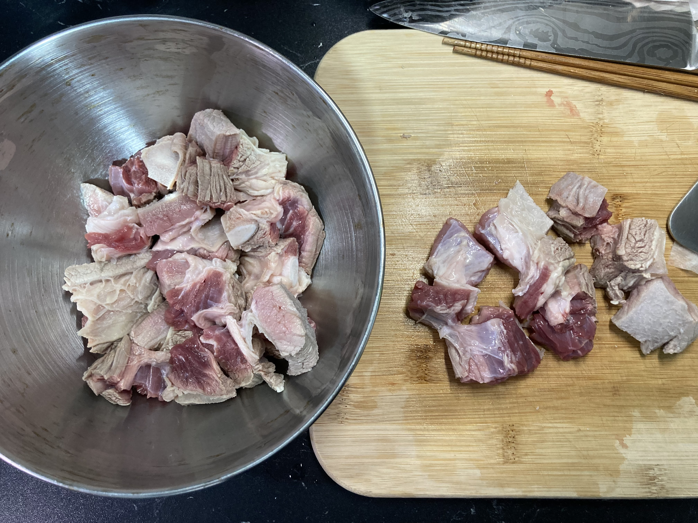
- Heat the pot over high heat, add oil, pour bowl 1 (ginger, garlic, small hot peppers) into the pot and sauté until fragrant
- Medium-low heat, pour bowl 2 (spices) into the pot, stir-fry evenly for about 30 seconds
- Medium-low heat, put bowl 3 (red fermented bean curd), use a spatula to crush the red fermented bean curd
- Medium-low heat, put bowl 4 (Doubanjiang), stir-fry evenly for about 30 seconds
- Medium-low heat, put bowl 5 (rock sugar) and stir-fry until melted
- Medium-low heat, add the beef brisket and stir-fry until the beef is colored
- High heat, pour bowl 6 (wine) along the side of the pot, stir-fry quickly until the surface of the beef is slightly charred
- Pour bowl 7 (sauce), stir-fry quickly, pay attention to the juice at the bottom, stir-fry until small bubbles keep popping up and the soup becomes slightly thick
  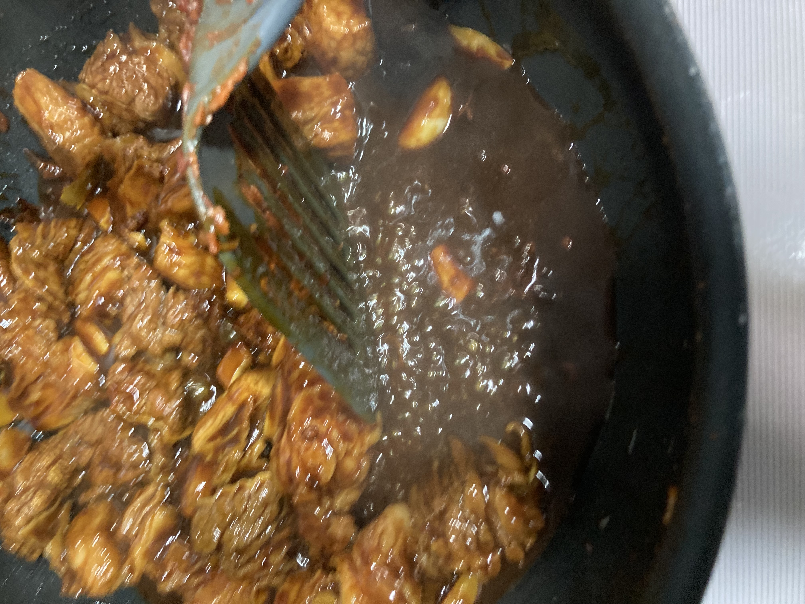
- Transfer all the ingredients in the pot to another stew pot or pressure cooker, add water to submerge the ingredients
  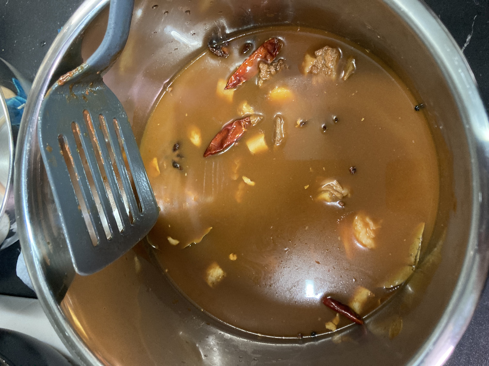
- Choose the time for stewing the meat according to the pot used:

  - a. Ordinary stew pot: simmer over low heat for 3 hours
  - b. Pressure cooker: pressure for 40 minutes

- After the time is up, open the lid and season. If it is not salty enough, add salt or light soy sauce (add a small amount and taste it continuously until it is suitable), and add sugar if it is not sweet enough.
- After adjusting the taste, take out the beef brisket first
- If you want to eat radish and potatoes, peel them and cut them into 2cm thick slices and pour them into the pot and cook for 10-15 minutes (or cook to the desired taste), if it is a pressure cooker, add pressure and cook for 5 minutes
  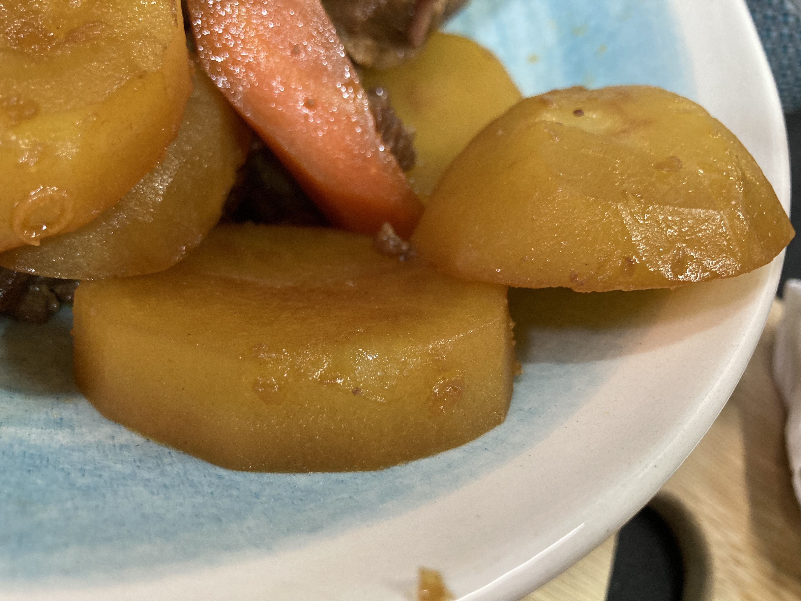
- After cooking, take out the radish and potatoes and put them together with the beef brisket
- Filter the soup and pour it into a bowl
  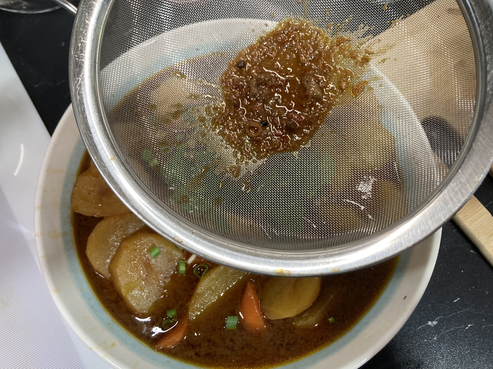

## Additional content

- Reference: [Chu Hou Beef Brisket + Chinese Yam and Water Chestnut Drink Recipe](https://www.bilibili.com/video/BV12C4y1W7ox)
- Pay attention to safety when operating the pressure cooker!

If you follow the production process in this guide and find any problems or processes that can be improved, please submit an Issue or Pull request.
