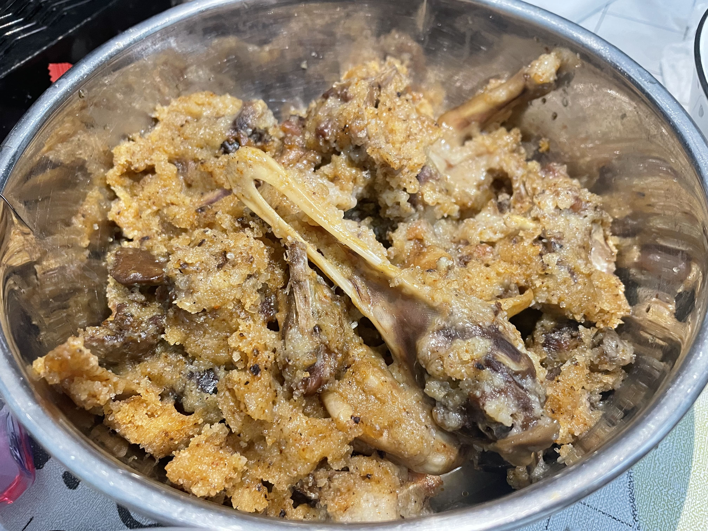
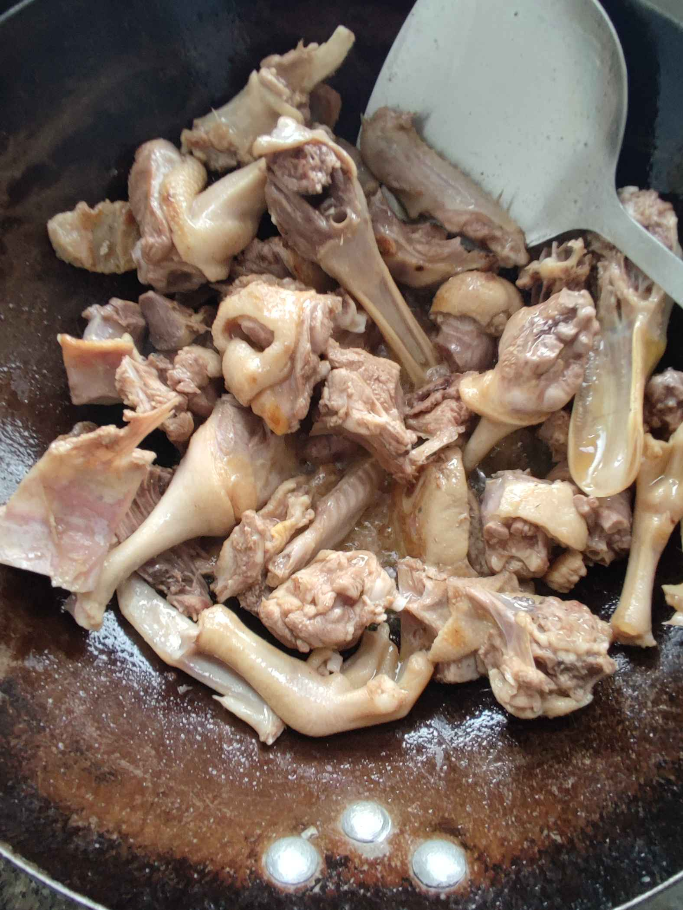
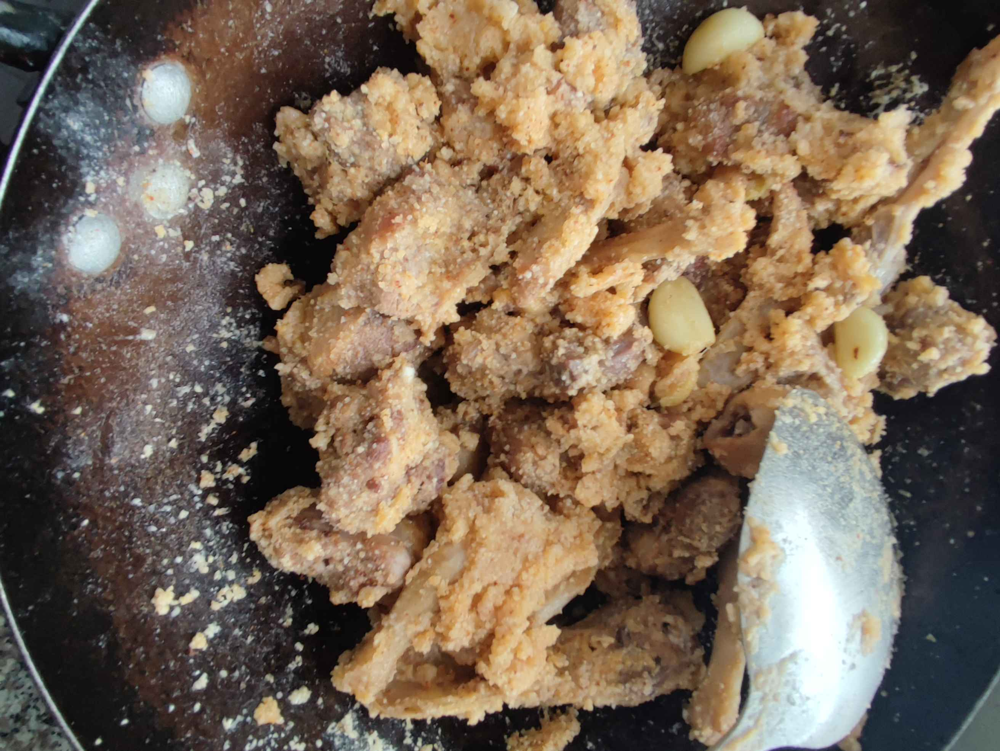

# How to Make Xiangqi Mifu Duck

A specialty dish in the two Qi regions of Hunan Province, every family has it on the table during the New Year and festivals. The duck meat is wrapped in rice flour, and the salty and fragrant taste is long-lasting and can relieve homesickness.

Estimated cooking difficulty: ★★★★

## Essential Ingredients and Tools

- Duck (must be fresh and freshly killed)
- Glutinous rice flour
- Rice flour
- Steamed meat powder
- Fine chili powder (add if you like spicy food)
- White pepper powder
- Pork belly (can be added or not)
- Ginger and garlic
- Salt
- Cooking oil
- Boiling water

## Calculation

Normal serving for 3-4 people

- Duck: 1000g
- Glutinous rice flour: 100g
- Rice flour: 300g
- Steamed meat powder: 50g
- Fine chili powder: 50g
- White pepper powder: 5g
- Pork belly: 50g
- Ginger and garlic: 20g
- Salt: 10g
- Cooking oil: 10g
- Boiling water: 100g

## Operation

* Mix glutinous rice flour, rice flour, steamed meat powder, fine chili powder, 5 grams of salt, and white pepper powder together
* Ask the enthusiastic vendor to chop the duck into steaming pieces, slice the ginger, peel the garlic, and slice the pork belly
* Heat the pot with cold oil and stir-fry the pork belly to extract oil, then add cooking oil and heat it, add the duck and stir-fry
* Stir-fry the duck until the surface turns brown, add ginger, garlic and salt and continue to stir-fry until fragrant
* Turn to low heat, pour in rice flour and stir-fry, coat the duck meat evenly with rice flour, add boiling water, add a small amount several times, stirring while adding
* Stir-fry the duck meat and rice flour until they feel moist, shovel it out into a bowl, put water in a pressure cooker and steam for 20-25 minutes
* Sprinkle with chopped green onion before serving and enjoy

## Additional content

This is a hometown dish.
The duck variety is not limited. The one bought here is a teal, priced at 24.
Steam for 20 minutes, if it is an old duck, steam for more than an hour.
In the first step, rice flour is the main flour, glutinous rice flour is added for a soft and glutinous taste, steamed meat powder is added for a five-spice flavor, and chili powder and pepper powder are added for a complex aroma.

The following are important steps for reference:

If you follow the production process in this guide and find any problems or processes that can be improved, please submit an Issue or Pull request.
