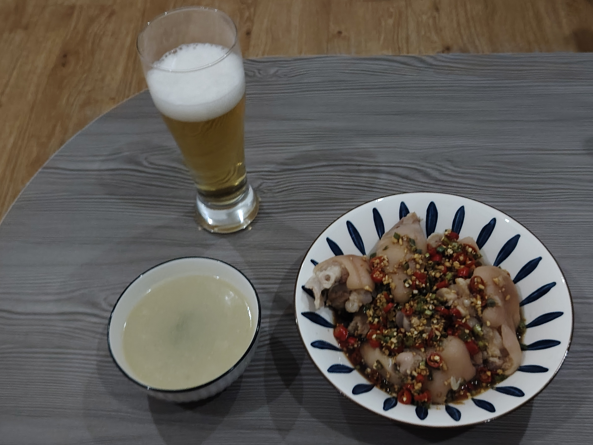
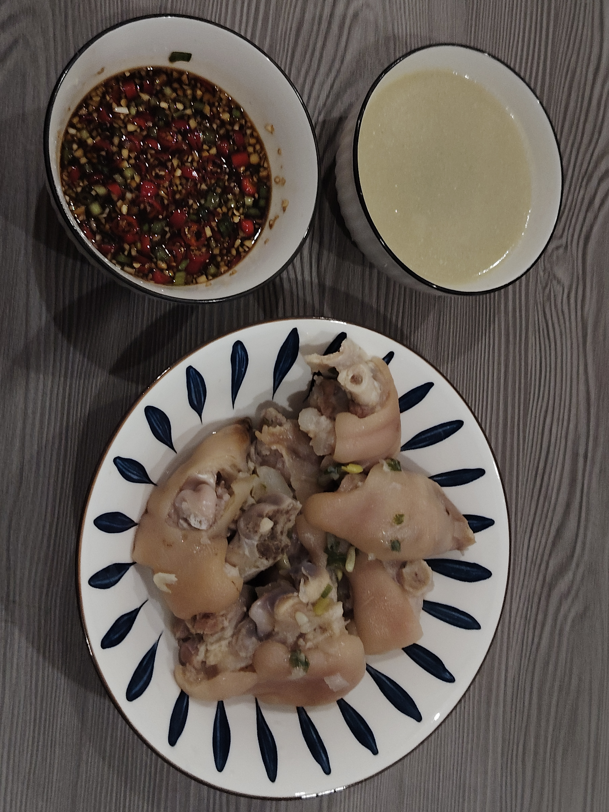

# How to Make Mom's Pig Trotters

Braised pig trotters are nutritious and delicious, with a delicate taste, soft and boneless, and the spicy and sour sauce is simply delicious!

Estimated cooking difficulty: ★★★★

## Essential Ingredients and Tools

- Pig trotters (try to choose front trotters: more meat, more tendons and fewer bones)
- Green onion
- Ginger
- Cooking wine
- Light soy sauce
- Dahurian angelica
- Angelica (optional)
- Chicken essence
- Salt
- Garlic
- Small hot peppers
- White pepper powder
- Light soy sauce
- Fragrant vinegar
- Sichuan peppercorn oil
- Chili oil (optional)
- White kidney beans (seaweed can be used if not available)

## Calculation

One serving is enough for 2-3 people.

- Pig trotters: 3
- White kidney beans: 200g
- Angelica: 2g
- White pepper powder: 5g
- Ginger slices: 30g
- Angelica: 2g
- Minced garlic: 8g
- Chicken essence: 2g
- Light soy sauce: 25g
- Chopped green onion: 10g

## Operation

### Start making

- Soak 200g of white kidney beans in clean water overnight for later use
- Prepare the front trotters, ask the master to split them in the middle when buying vegetables, use a flamethrower to remove the hair follicles, and wash them at home
- Add pig trotters, green onion sections, ginger slices, and cooking wine to the pot with cold water to blanch for ten minutes, skim off the foam, take out and wash for later use
- Put the pig trotters, Dahurian angelica, Angelica, white pepper powder, and ginger slices into the pressure cooker, pressure for 30 minutes after the air comes out, add white kidney beans, and pressure for another 10 minutes. At this time, if the soup is milky white, then congratulations, it is correct (if you need to add water in the middle, you can only add hot water)

- After opening the lid, add salt, chicken essence, and chopped green onion to taste
- Prepare the soul sauce: add green onion, garlic, small hot peppers, white pepper powder, light soy sauce, fragrant vinegar, chili oil, Sichuan peppercorn oil, and pig trotter broth to the bowl
  
- Pour the soul sauce on

## Additional content

- When operating, pay attention to observing the boiling water level. If it is found to be lower than 3/4 of the ingredients, add hot water to submerge the ingredients.
- Chicken feet deboning tutorial: [bili_89324373958](https://www.bilibili.com/video/BV1t44y117D8?share_source=copy_web)

If you follow the production process in this guide and find any problems or processes that can be improved, please submit an Issue or Pull request.
