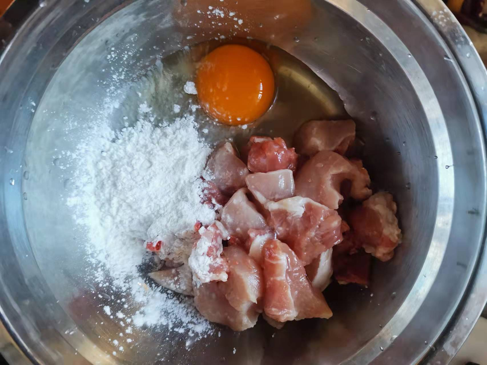
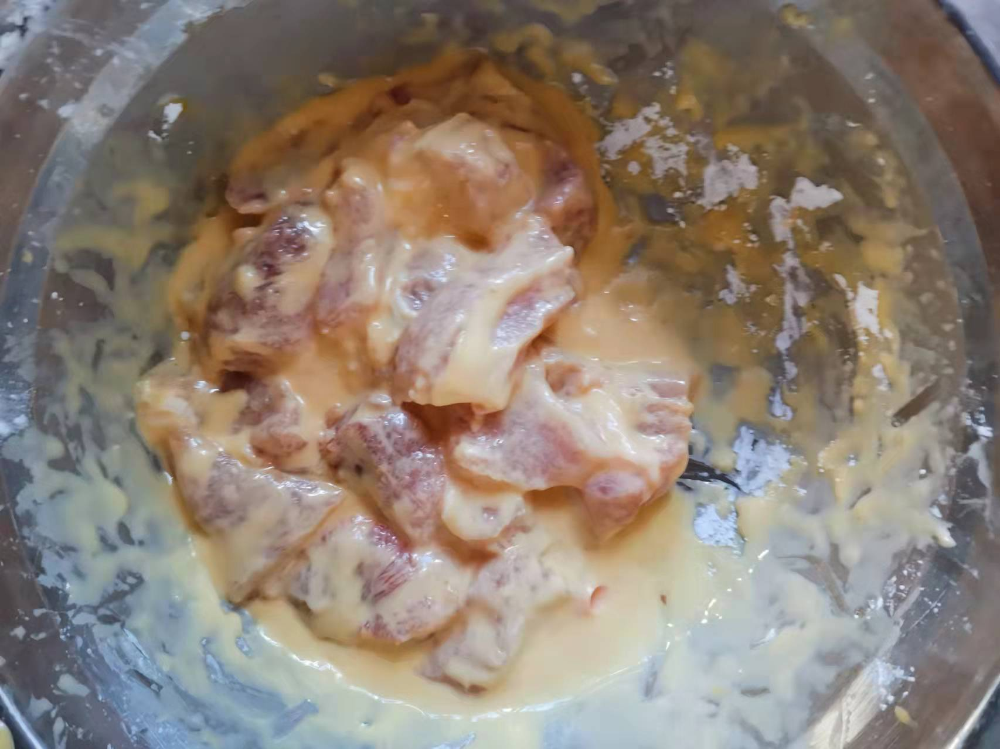
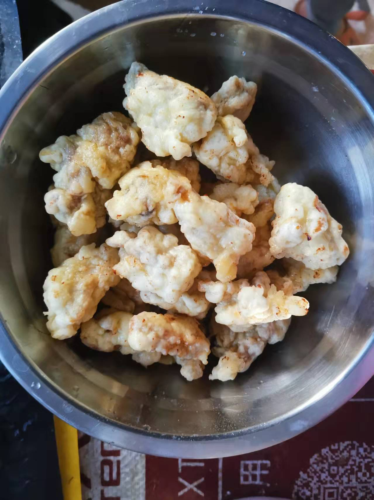
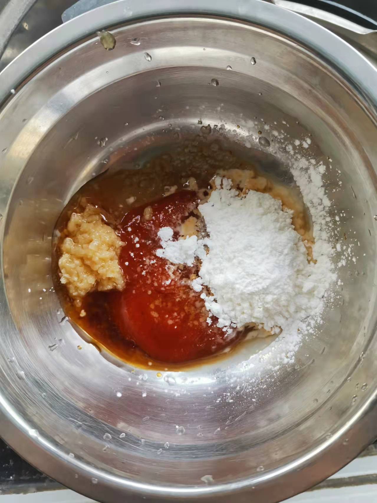

# How to Make Lychee Pork

Lychee pork has unique Min cuisine characteristics and a sweet and sour taste. It is a relatively common dish in the Fuzhou area.

Estimated cooking difficulty: ★★★★

## Essential Ingredients and Tools

*   Lean meat
*   Pineapple
*   Egg
*   Cooking oil
*   White sugar
*   Starch
*   Light soy sauce
*   Chicken essence
*   Minced ginger
*   Sesame
*   Ketchup
*   Aromatic vinegar

## Calculation

Per serving:

*   Fresh shiitake mushrooms 2
*   Crab mushrooms 30 g
*   Lean meat 150 g
*   Pineapple 100 g
*   Egg 1
*   Cooking oil 500 ml
*   White sugar 5 g
*   Starch 100 g
*   Light soy sauce 5 ml
*   Chicken essence 5 g
*   Minced ginger 5 g
*   Sesame 2 g
*   Ketchup 20 g
*   Aromatic vinegar 2 ml

## Operation

*   Cut the lean meat into pieces (2-3 cm each), put them in a large bowl, add 1 egg, 50 g of starch, 3 ml of light soy sauce, and 2 g of chicken essence.
*   Mix thoroughly until the starch coats the lean meat pieces (if it is too thin, continue to add starch, if it is too dry, add water), then add 5 ml of oil, and set aside after mixing thoroughly.
*   Prepare another bowl, add ketchup, 3 g of chicken essence, 2 ml of light soy sauce, minced ginger, white sugar, 10 g of starch, aromatic vinegar, and 200 ml of cold water, and set aside after mixing thoroughly.
*   Cut a pineapple and prepare 6 pineapple chunks (1.5-2 cm each).
*   Heat the pot and heat the oil, pour in 500 ml of oil, and keep heating the oil until you hear the sound of frying.
*   Put the lean meat one by one into the pot (remember not to pour the whole bowl in), and make sure each piece of meat does not stick together.
*   After all the lean meat is put in, turn the lean meat pieces back and forth every 30 seconds with a spoon until the surface of the lean meat pieces is golden brown.
*   Remove the lean meat, pour it into the oil pan again after one minute and continue to fry until the surface of the lean meat pieces is焦yellow, take it out and put it in a large bowl for later use.
*   Heat the pot, pour in the soup, pour in the lean meat pieces and pineapple chunks after 30 seconds, stir-fry thoroughly and remove from the pot.
*   Garnish with sesame seeds.

## Additional content

*   In most cases, local Fuzhou will choose horseshoe (to relieve greasiness) and potatoes (to wash oil), but because they cannot be bought during the epidemic, pineapple is used.
*   Min cuisine is mainly sweet, so you can give up white sugar if you are not used to it.
*   You can tap the lean meat pieces with a spoon and listen to the sound to determine whether the lean meat is thoroughly fried.

If you follow the production process in this guide and find any problems or processes that can be improved, please submit an Issue or Pull request.
