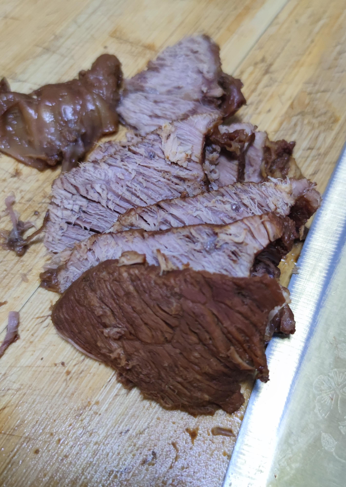

# How to Make Soy Sauce Beef

Homemade soy sauce beef is rich in nutrition and tastes delicious. It is great as a staple food or as a side dish. Generally, beginners only need 3 hours to complete.

Estimated cooking difficulty: ★★★★★

## Essential Ingredients and Tools

- Beef
- Bay leaf
- Ginger
- Scallions
- Dark soy sauce
- Cinnamon
- Rock sugar
- Sichuan peppercorns
- Cooking wine
- Light soy sauce
- Salt
- Star anise
- Yellow soybean paste

## Calculation

Per serving:

- Beef 2000 grams
- Bay leaf 1 piece
- Ginger 3 slices
- Half a scallion
- Dark soy sauce 15ml
- Cinnamon 1 piece
- Rock sugar 7-8 pieces
- Sichuan peppercorns 15 pieces
- Cooking wine 30ml
- Light soy sauce 15ml
- Salt 8 grams
- Star anise 4 pieces
- Yellow soybean paste 15ml

## Operation

- Soak the beef for 4-6 hours, add cooking wine and ginger slices to remove the blood
- Cut the beef into pieces of 8cm, no more than 10cm
- Put the beef in a pot, add cold water until the water surface covers the beef, bring to a boil and start timing after the water boils, stop the fire after 3 minutes, remove the beef, and wash it with warm water
- Put the washed beef into a casserole or stew pot, add water to cover the beef, turn on high heat, and add other ingredients except salt.
- After the water boils, turn the high heat to low heat and continue heating for 90 minutes, add salt
- After adding salt, continue to simmer for 90 minutes (Note: Check the water level every 30 minutes, requiring at least 80% of the beef surface height)
- After heating for 180 minutes, remove the beef, let it cool naturally, and slice
- Serve on the table, it is recommended to refrigerate other unsliced beef.

## Additional content

- During operation, pay attention to observing the boiling water level. If it is found to be lower than 2/3 of the ingredients, add hot water to cover the ingredients (about every 30 minutes).

### Reference materials

- [Recipes in the Kitchen App](http://www.xiachufang.com/recipe/106670199/)

If you follow the production process in this guide and find any problems or processes that can be improved, please submit an Issue or Pull request.
