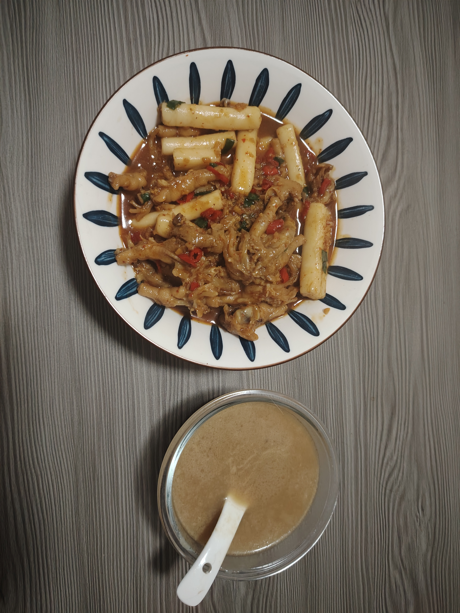
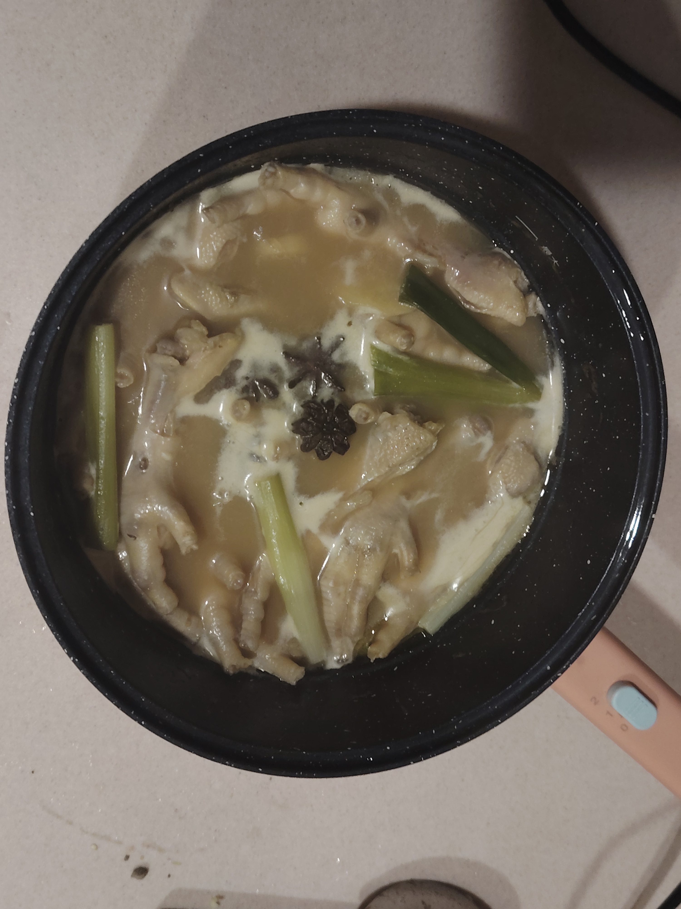

# How to Make Spicy Chicken Feet Pot

Spicy chicken feet pot tastes Q弹, spicy and rich, with endless aftertaste.

Estimated cooking difficulty: ★★★★

## Essential Ingredients and Tools

- Chicken feet
- Scallions
- Ginger
- Cooking wine
- Bay leaf
- Star anise
- Light soy sauce
- Dark soy sauce
- Garlic
- Millet pepper
- Chili powder (optional)
- Oyster sauce
- Five-spice powder
- Salt
- Chicken essence

## Calculation

- 1 catty of chicken feet
- 3 bay leaves
- 3 star anise
- 6 millet peppers
- 10g minced ginger
- 10g minced garlic
- 2 scallions
- 3g oyster sauce

## Operation

- Cut off the nails of the chicken feet. If the chicken feet you bought only have the palm part, cut them in half. If it is a whole chicken feet, it needs to be boned. Wash it with clean water.
- Put the chicken feet in a pot with cold water, add scallions, ginger, and cooking wine to blanch the water, boil the water, and skim off the floating foam.
- Add bay leaves, star anise, light soy sauce, and dark soy sauce, cover and simmer for 30 minutes on low heat.
  
- Remove the chicken feet and set aside a bowl of chicken soup for later use.
- Heat the pot and add oil, use a small fire to stir-fry minced ginger, minced garlic, and millet pepper until fragrant, add more chili powder if you can eat spicy food. Add light soy sauce, dark soy sauce, oyster sauce, five-spice powder, and salt to stir-fry the sauce.
- Add chicken feet, add a little salt to taste, stir-fry for one or two minutes, then pour in chicken soup, stir while frying.
- Add chicken essence to freshen, sprinkle in scallion segments and stir well before serving.

Note: If you need to add side dishes, please do it before adding chicken feet, after the base is stir-fried.

## Additional content

If you follow the production process in this guide and find any problems or processes that can be improved, please submit an Issue or Pull request.
