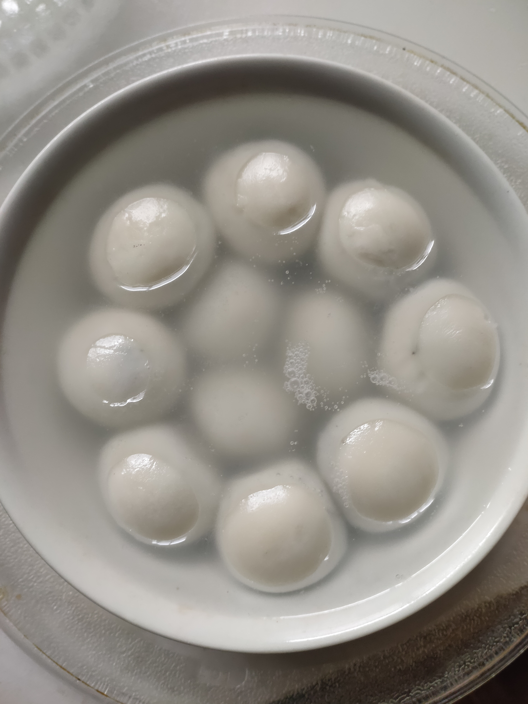

# How to Cook Frozen Tangyuan (Sweet Rice Balls)

Frozen Tangyuan is a simple and easy dish to make. Generally, beginners only need 6 minutes to complete it.

Estimated cooking difficulty: ★

## Essential Ingredients and Tools

*   Frozen Tangyuan
*   Microwave

## Calculation

Per serving:

*   Frozen Tangyuan: 11. The number depends on the size of the bowl. Make sure that the highest Tangyuan placed does not exceed the bowl height - 5mm.

## Operation

*   Take out the frozen Tangyuan and put it in a bowl.
*   Pour in boiling water until the Tangyuan is submerged.
*   Microwave on high heat for 4 minutes.
*   If the Tangyuan has absorbed water and expanded, it is cooked.
*   If it is not cooked, heat it for another 1 minute.

## Additional content

*   Be careful to add Tangyuan first and then hot water, do not reverse the order, otherwise the Tangyuan poured into hot water may splash out and cause burns. And the water level cannot be controlled and may overflow.
*   If the bowl is too hot to take out in the microwave, you can use a towel, or some microwaves can be taken out together with the tray.

If you follow this guide and find any problems or improvements, please submit an Issue or Pull request.
