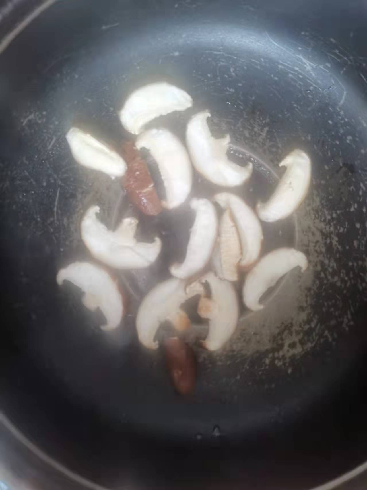
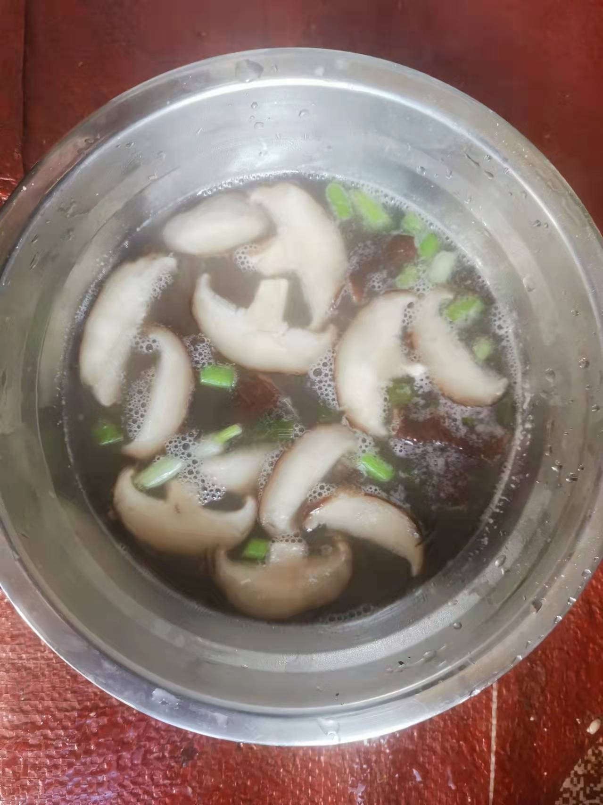

# Thickened Shiitake Mushroom Soup Recipe (Placeholder Translation)

In addition to being stir-fried with meat, fresh shiitake mushrooms are also very delicious when used to make a thick, thickened soup.

Estimated cooking difficulty: ★★★

## Essential Ingredients and Tools

*   Shiitake mushrooms
*   Scallions
*   Cooking oil
*   Salt
*   Chicken essence
*   Cornstarch

## Calculation

Per serving:

*   Fresh shiitake mushrooms 2
*   Scallions 0.5
*   Chicken essence 3 g
*   Cooking oil 10 ml
*   Salt 3 g
*   Boiling water 350 ml
*   Cornstarch 10 g

## Operation

*   Slice the shiitake mushrooms (each slice is 0.5-1 cm thick, thicker ones are more chewy than thinner ones), put them in a large bowl, and pour in 2g of salt and soak for 15 minutes.
*   Pour the cornstarch into a small bowl, add 50ml of water, and stir the cornstarch until it dissolves and there are no particles (i.e. water starch).
*   Pour out the salt water in the bowl, and appropriately remove the moisture from the shiitake mushrooms themselves (to facilitate the next step of frying) [optional]
*   Low heat, pour in oil, wait for the oil to start bubbling (low heat for 30s, depending on the power of each pot), pour in the shiitake mushrooms, fry each side for 10s [optional]
*   Pour in 300ml of boiling water, turn to medium heat and cook for another 3-5 minutes
*   Pour in the water starch, stir the soup in the pot appropriately, add 3g of salt, 3 g of chicken essence, and finally sprinkle with chopped green onion before serving.

## Additional Content

If you follow this guide and find any problems or improvements, please submit an Issue or Pull request.
