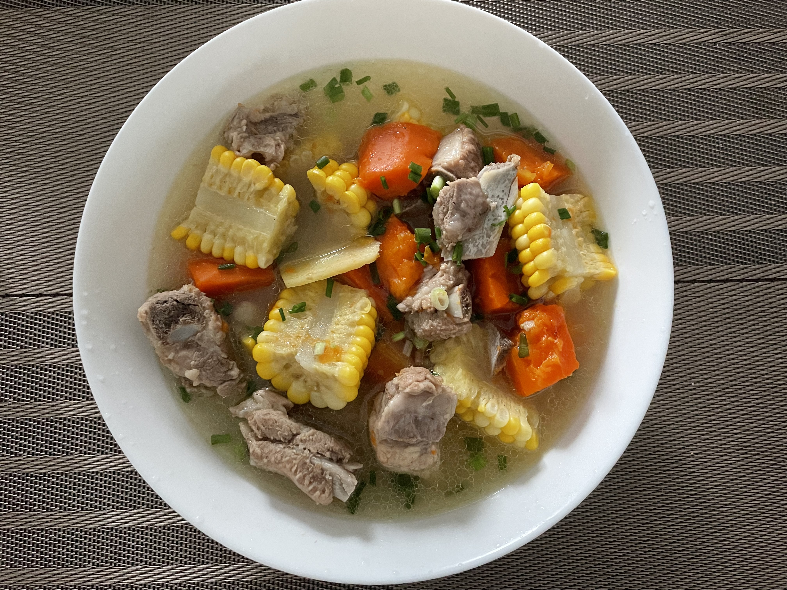

# Corn and Rib Soup Recipe (Placeholder Translation)

In addition to being braised or stewed, fresh ribs can also be used to make soup. The soup made with corn and carrots is very delicious.

Estimated cooking difficulty: ★★★

## Essential Ingredients and Tools

*   Ribs
*   Corn
*   Carrots
*   Ginger
*   Green onion
*   Cooking oil
*   Vinegar
*   Cooking wine
*   Black pepper
*   Salt
*   Casserole (if not, you can use an iron pot)

## Calculation

Per serving:

*   Ribs 500-800g
*   One corn (you can add more if you like corn)
*   One carrot (you can add more if you like carrots)
*   Half a green onion
*   One scallion
*   Cooking oil 10 ml
*   Black pepper 4g
*   Cooking wine 10ml
*   Vinegar 10ml
*   Salt 10-15g (depending on the final amount of soup)
*   Boiling water 1000 ml

## Operation

### Prepare dishes

*   Cut the green onion into 3-4cm sections and pat with the back of a knife
*   Chop the corn into small pieces
*   Cut the carrots into chunks
*   Peel and slice the ginger
*   Chop the fresh ribs into small pieces

### Operation

*   Put the ribs in a pot with cold water, add green onion, ginger, and cooking wine to blanch. Bring to a boil over high heat, skim off the foam, remove the ribs, and drain.
*   Heat the pot with cold oil, add sliced ginger and ribs and stir-fry together. When the surface of the ribs is slightly browned, add vinegar (to speed up the softening of the meat) and continue to stir-fry for one minute.
*   Pour in boiling water, give enough at once, and don’t add any more later. Bring to a boil over high heat.
*   First add the corn, add black pepper, cover and simmer over low heat for 20 minutes, then add the carrots, cover and continue to simmer over low heat for 40 minutes.
*   The seasoning is very simple. Three minutes before serving, add nothing but salt, and finally sprinkle with a handful of chopped scallions.

## Additional Content

This dish is not difficult to make, and the ingredients are simple. It is friendly to novices and suitable for a big bowl when the temperature drops.

If you follow this guide and find any problems or improvements, please submit an Issue or Pull request.
