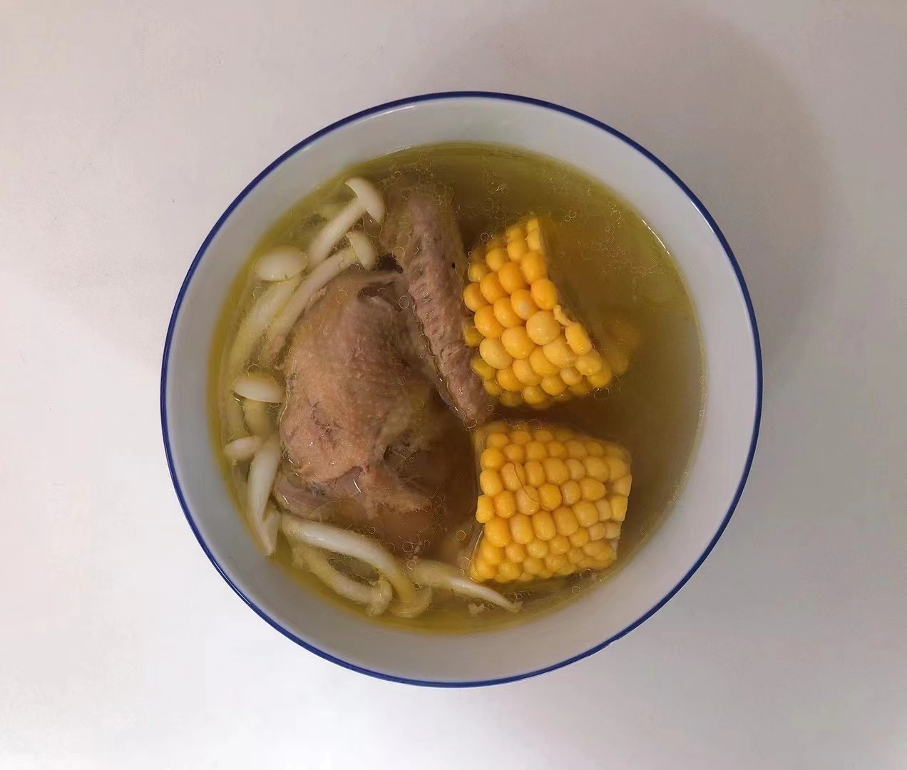

# Mushroom Stewed Pigeon Recipe (Placeholder Translation)

- Mushroom stewed pigeon soup is fresh, the meat is tender, and it is rich in nutrition

Estimated cooking difficulty: ★★★★

## Essential Ingredients and Tools

*   Pigeon
*   Mushroom
*   Corn
*   Ginger
*   Cooking wine
*   Salt
*   Earthen pot or pressure cooker

## Calculation

For 2 people:

*   Pigeon 300 g
*   Mushroom 100 g
*   Corn 200 g
*   Ginger 30 g
*   Cooking wine 15 ml
*   Salt 10 g

## Operation

*   Wash the pigeon processed by the enthusiastic stall owner with cold water
*   Put the washed pigeon into a cold water pot, add 15ml of cooking wine and ginger, boil the water and remove the pigeon, otherwise it will lose nutrients
*   Put the pigeon into a high compression or earthen pot, pour water over the pigeon, add 20 g of ginger, 200 g of corn, and 100 g of mushrooms

    Note: Pressure cooker for 30 minutes, earthen pot needs to be simmered over low heat for 40-60 minutes after the water boils
*   When the time is up, serve into a bowl and add 3~5g of salt

## Additional Content

If you follow this guide and find any problems or improvements, please submit an Issue or Pull request.
