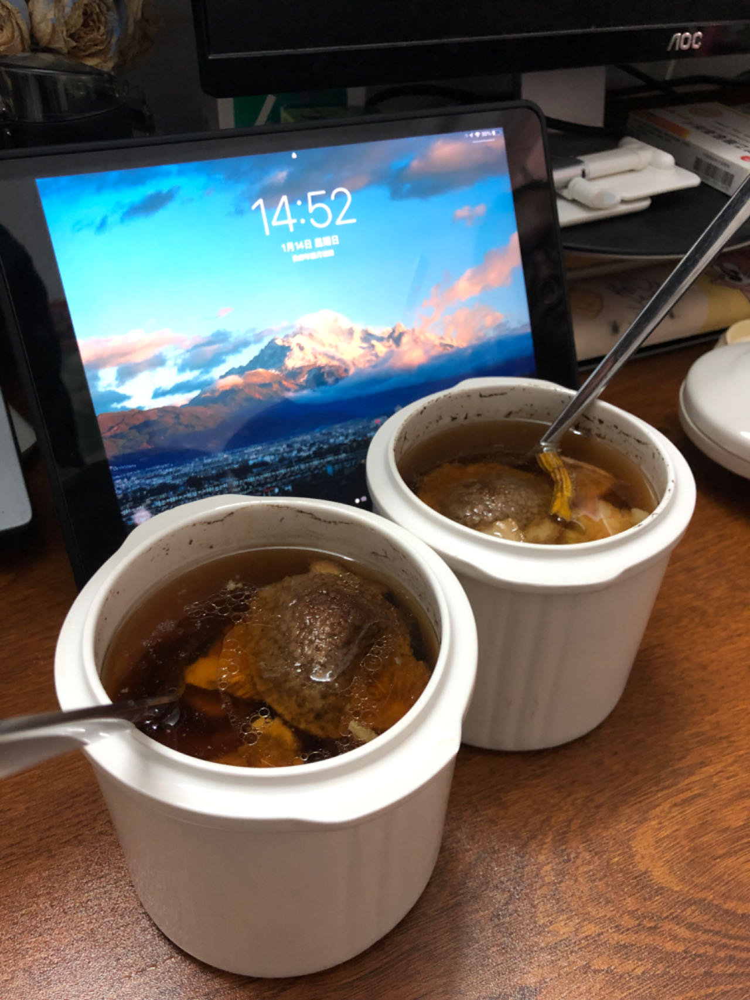

# Tangerine Peel Rib Soup Recipe (Placeholder Translation)

In addition to being used for braising or stewing, fresh ribs can also be used for soup. The soup made with Guangdong tangerine peel is very healthy and has certain nourishing effects on the spleen, stomach, lungs and throat. It is a must-have for those who stay up late.

Estimated cooking difficulty: ★★★

## Essential Ingredients and Tools

*   Ribs
*   Tangerine peel
*   American ginseng
*   Dendrobium
*   Polygonatum
*   Ophiopogon japonicus
*   Soup pot
*   Salt

## Calculation

Per serving:

*   Ribs, pork bones can also be used as a substitute, 4-5 pieces
*   Tangerine peel (generally 8-20 years old is selected), generally 1 piece of tangerine peel is 3 petals, take 1 petal
*   American ginseng (also known as Panax quinquefolius), 9 slices
*   Dendrobium, 6 pieces
*   Polygonatum, 5 slices
*   Ophiopogon japonicus, 7 pieces
*   Soup pot, 1 serving
*   Salt, 5g

## Operation

### Prepare dishes

*   Blanch the ribs in hot water to remove blood
*   Rinse the tangerine peel, Ophiopogon japonicus, Polygonatum, Dendrobium and American ginseng
*   Wash the soup pot

### Operation

*   Open the soup pot, first put the ribs at the bottom, and then put the tangerine peel, Ophiopogon japonicus, Polygonatum, Dendrobium and American ginseng in order
*   Add hot water to the soup pot, the water should not be too full
*   Add water to the soup container and simmer for 1.5 hours
*   Add salt and drink while it's hot

## Additional Content

The soup pot is very hot, be careful not to get burned or slip and break it when taking it.
Guangdong 老火靓汤 (Guangdong 老火靓汤) (old fire soup) pays attention to ingredients and heat. As long as the ingredients are prepared and simmered for a certain period of time, it will be a success!

If you follow this guide and find any problems or improvements, please submit an Issue or Pull request.
