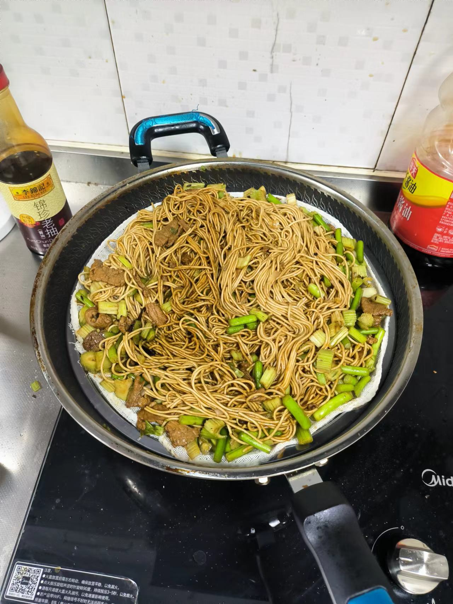

# Henan Steamed Noodles Recipe

Henan steamed noodles are a popular snack in Henan, and you can also use the挂面 (挂面) (dried noodles) at home to make them.

Simply put, the挂面 (挂面) (dried noodles) are first coated with oil and steamed in a steamer, then stir-fried with vegetables and seasonings, and finally steamed a second time to achieve a flavorful and劲道 (劲道) (chewy) effect.

Estimated cooking difficulty: ★★★★

## Essential Ingredients and Tools

- 挂面 (挂面) (dried noodles) (round ones are recommended)
- Pork belly
- Garlic sprouts
- Scallions + ginger + garlic + cooking wine
- Salt + chicken essence + thirteen spices
- Light soy sauce + dark soy sauce + oyster sauce
- Sesame oil
- Oil + pot +菜刀 (菜刀) (kitchen knife) +铲子 (铲子) (spatula)
- Steaming 篦子 (篦子) (rack)
- Extra盆 (盆) (basin)

## Calculation

The following amount is only enough for one person's staple food for one meal! Please adjust the amount of ingredients according to the actual situation!

Per serving:

- 挂面 (挂面) (dried noodles) 300g
- Pork belly 350g
- Garlic sprouts 150g
- Cooking oil 10-15ml
- Light soy sauce 15ml
- Dark soy sauce 10ml
- Oyster sauce 5ml
- Salt 2g
- Chicken essence 2g
- Thirteen spices 1g
- Scallions 10g
- Ginger 5g
- Garlic 10g
- Cooking wine 5ml
- Sesame oil 5ml

## Operation

### First steaming

- Add 70% water to the pot, bring to a boil, put on the steaming 篦子 (篦子) (rack)
- Spread the挂面 (挂面) (dried noodles) evenly, drizzle 5ml of oil and spread evenly, steam for 15 minutes
- Take out the挂面 (挂面) (dried noodles) and steaming 篦子 (篦子) (rack), place them aside, and pour out the water in the pot

### Cutting vegetables

- Pork belly, cut into 2mm thick slices
- Garlic sprouts, cut into 3cm sections
- Scallions, cut into 0.2cm thin slices
- Ginger, cut into 1mm x 1mm x 3cm thin shreds
- Garlic, put on the cutting board and拍碎 (拍碎) (crush), cut into 1mm particles

### Stir-frying

- Heat the pot, dry the water, add 3ml of cooking oil
- Hold the pot handle and shake the pot to fully coat 2/3 of the pot with cooking oil
- Add meat slices over medium heat and stir-fry for 1 minute
- Add scallions, ginger, garlic, and cooking wine, and continue to stir-fry for 1 minute
- Add the garlic sprout sections to the pot and stir-fry for 1 minute
- Start seasoning, add dark soy sauce, light soy sauce, oyster sauce, salt, chicken essence, and thirteen spices, stir-fry for 1 minute
- Add 500ML of water, cover the vegetables, and simmer for 1 minute
- Add the steamed挂面 (挂面) (dried noodles), stir constantly for 3 minutes, wait for the挂面 (挂面) (dried noodles) to be evenly colored, turn off the heat
- Pour the stirred挂面 (挂面) (dried noodles) and vegetables into an extra盆 (盆) (basin)

### Second steaming

- Add 70% cold water to the pot, put on the steaming 篦子 (篦子) (rack), and spread the mixed noodles and vegetables evenly on top
- After the water boils, cook over high heat for 15 minutes and serve
- Drizzle with 10g of sesame oil and it is ready to eat

## Additional Content

The thickness and taste of挂面 (挂面) (dried noodles):

- Thin and round (most supermarkets have this kind, the taste is more劲道 (劲道) (chewy))
- Wide and flat (the taste is softer)

If you follow this guide and find any problems or improvements, please submit an Issue or Pull request.
