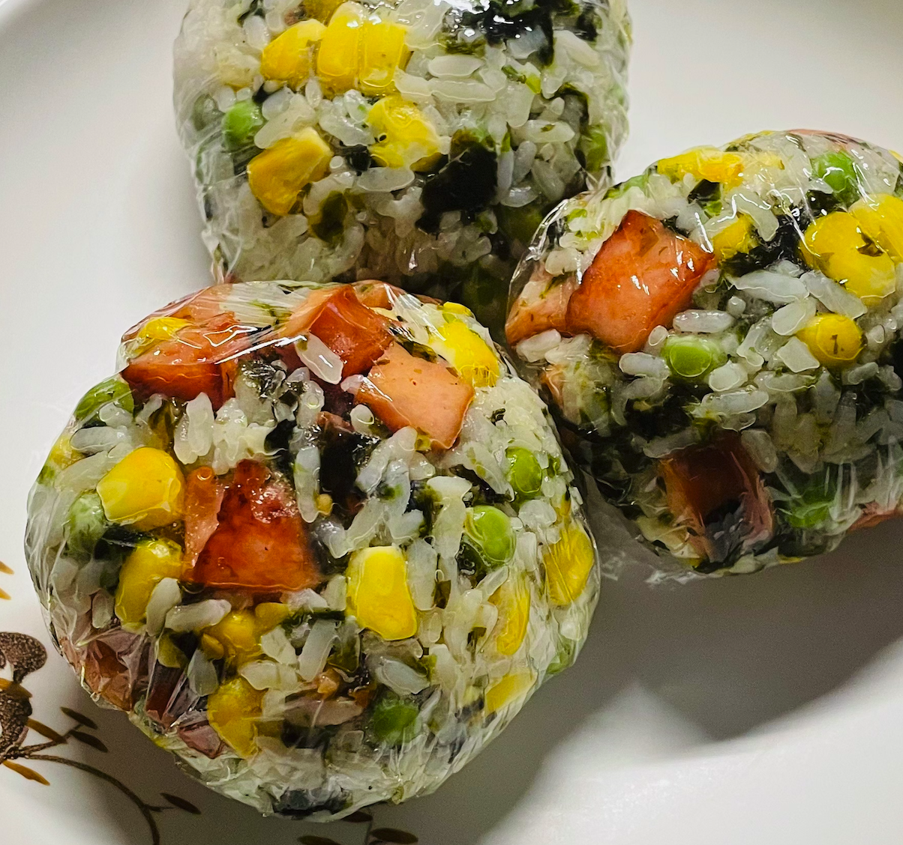

# Ham Rice Ball Recipe

Delicious! Rich in carbohydrates, protein and vitamins. The production difficulty is that you can do it with your hands, and the estimated production time is 1 h.

Estimated cooking difficulty: ★★★★

## Essential Ingredients and Tools

- Ham
- Rice
- Water
- Frozen green beans (optional)
- Frozen corn kernels (optional)
- Shredded seaweed (optional)
- Favorite salad dressing (recommended Japanese mayo!)

## Calculation

You need to determine how many servings you plan to make before each production. One serving is enough for 2 people.

Per serving:

- Ham (100g)
- Rice (125g)
- Water (90ml)
- Frozen green beans (30g)
- Frozen corn kernels (30g)
- Shredded seaweed (10g)
- Favorite salad dressing (20g)
- Cooking oil 10-15ml

## Operation

- Put the rice and water into the rice cooker, click the rice mode, and wait for it to complete
- Put the frozen corn kernels and green beans into the pot, add water to cover all the ingredients, wait for 2 minutes after boiling, and remove them.
- Cut the ham into 1cm squares
- At the same time, add 10ml of cooking oil, add the ham and stir-fry until the ham is colored
- Put the rice, ham, shredded seaweed, green beans, corn kernels, and salad dressing into a bowl, mix well
- Plate (if available)

## Additional Content

- The amount of salad dressing can be reduced or increased according to personal taste.
- You can try mixing salad dressings.
- Reference: Xiaohongshu - Dry rice players are sleepy again

If you follow this guide and find any problems or improvements, please submit an Issue or Pull request.
