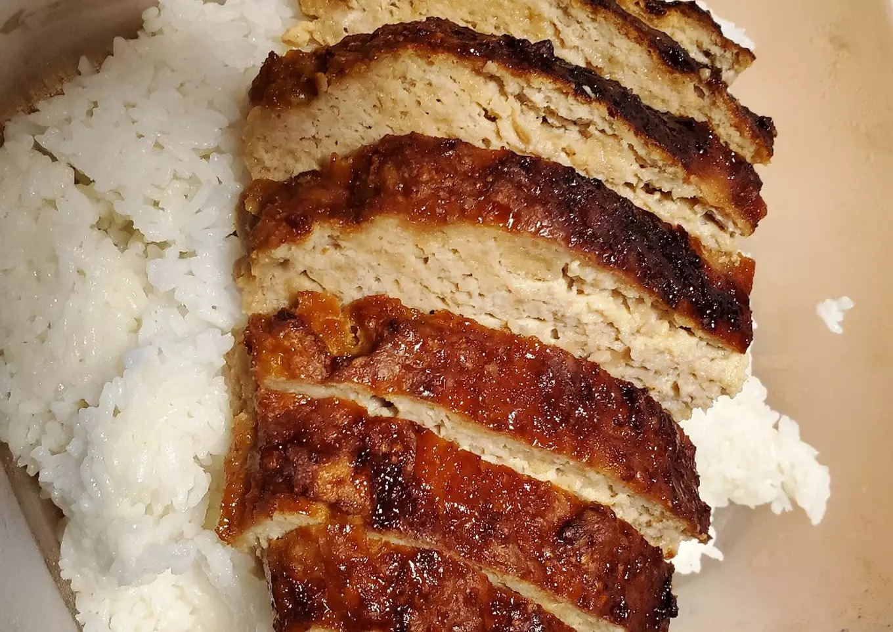

# Air Fryer Teriyaki Chicken Rice Recipe

Air fryer teriyaki chicken rice is a simple and easy-to-make dish. It is a convenient and cheap delicacy, and novices can fully master it while tasting the deliciousness!

Estimated cooking difficulty: ★★★★

## Essential Ingredients and Tools

- Ritz crackers
- Soy sauce
- Sugar (white granulated sugar)

## Calculation

You need to determine how many servings you plan to make before each production. One serving is enough for 1 person.

Per serving:

- Chicken 900g
- Soy sauce 100-125ml
- Sugar 60-65g
- White vinegar 30-35ml
- Ritz crackers (salty cookies can be substituted) 16 (48g)
- Eggs 2

## Operation

- Mix soy sauce, sugar and vinegar together, stir well and set aside
- In another bowl, add chicken, eggs, 1/2 of the sauce and crushed Ritz crackers. Mix well
- Line the air fryer with a foil bowl, add the meatloaf mixture, and pour the remaining sauce evenly on top
- Fry at **350°** for **40 minutes**. It is best to eat on rice<!-- Do not add ingredients not mentioned in the text or raw materials when describing the process. -->
- After the appearance is *golden and crispy*, take it out of the pot, cut it into pieces and serve

## Additional Content

- Pay attention to the temperature during operation to avoid burns.
- Reference: [Cookpad Gourmet Tutorial](https://cookpad.com/)

If you follow this guide and find any problems or improvements, please submit an Issue or Pull request.
