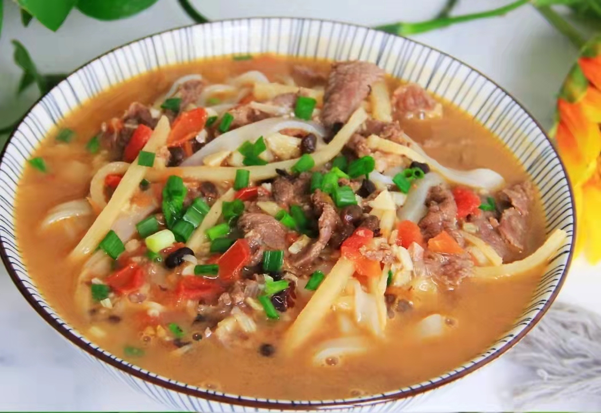

# Laoyou Pork Noodles Recipe

Estimated cooking difficulty: ★★★

## Essential Ingredients and Tools

- Rice noodles
- Pork
- Sour bamboo shoots
- Chopped pepper
- Douchi
- Garlic
- Cooking wine
- Light soy sauce
- White sugar
- Rice vinegar
- Salt
- Oil
- Cornstarch
- Pepper

## Calculation

Per serving:

- Rice noodles (250g, remember to soak in 50 degree warm water for half an hour)
- Pork (50g)
- Sour bamboo shoots (50g)
- Chopped pepper (15g, add appropriately according to personal needs after chopping the peppers.)
- Douchi (30g)
- Garlic (10g)
- Cooking wine (10-20ml)
- Light soy sauce (15ml)
- White sugar (5g, you can consider not adding if you don’t like sugar)
- Rice vinegar (5ml)
- Salt (5ml)
- Oil (15ml)
- Cornstarch (15ml)
- Pepper (10ml)

## Operation

- Put all the pork in a bowl and season with cooking wine, salt, light soy sauce, cornstarch, and pepper for later use
- Heat the pot without oil, add all the sour bamboo shoots and stir-fry to dry the water, leaving some space in the middle of the dried sour bamboo shoots
- Add 10ml - 15ml of cooking oil and all the garlic, chopped pepper, and douchi to the middle of the dried sour bamboo shoots, and stir-fry until fragrant
- Add all the seasoned pork and continue to add 10ml of light soy sauce and stir-fry for one minute
- Add 5ml of rice vinegar, 10ml of light soy sauce, and 450ml of clear water and bring to a boil
- After the water boils, add the rice noodles soaked in warm water and continue to cook for 3 minutes before serving

## Additional Content

- Remember that the rice noodles must be soaked to be delicious, otherwise it will be difficult to eat!

If you follow this guide and find any problems or improvements, please submit an Issue or Pull request.
