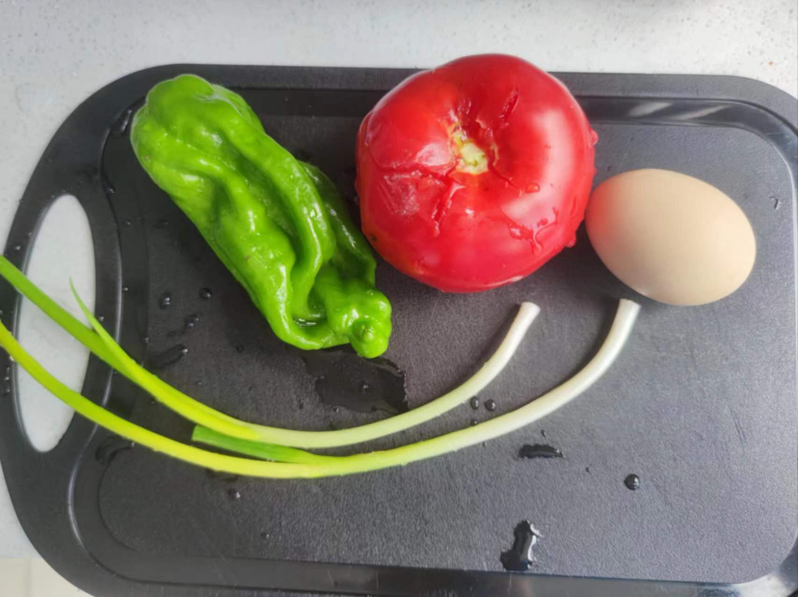
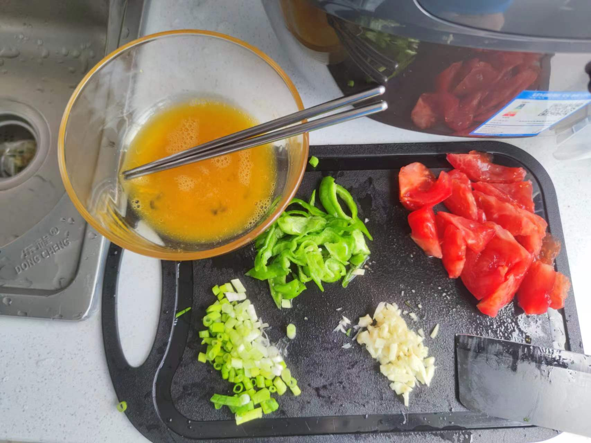
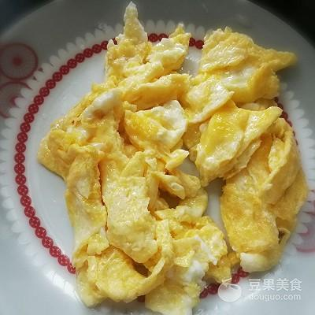
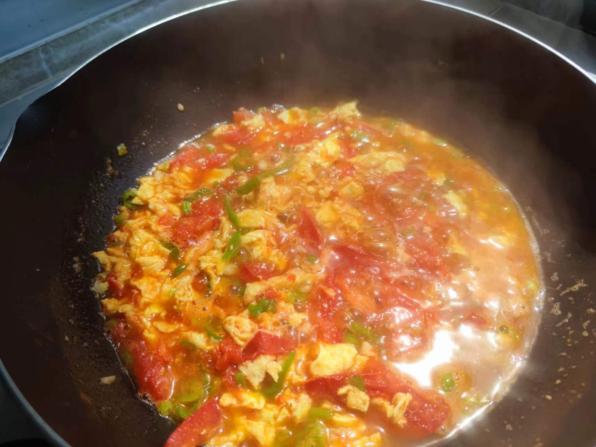
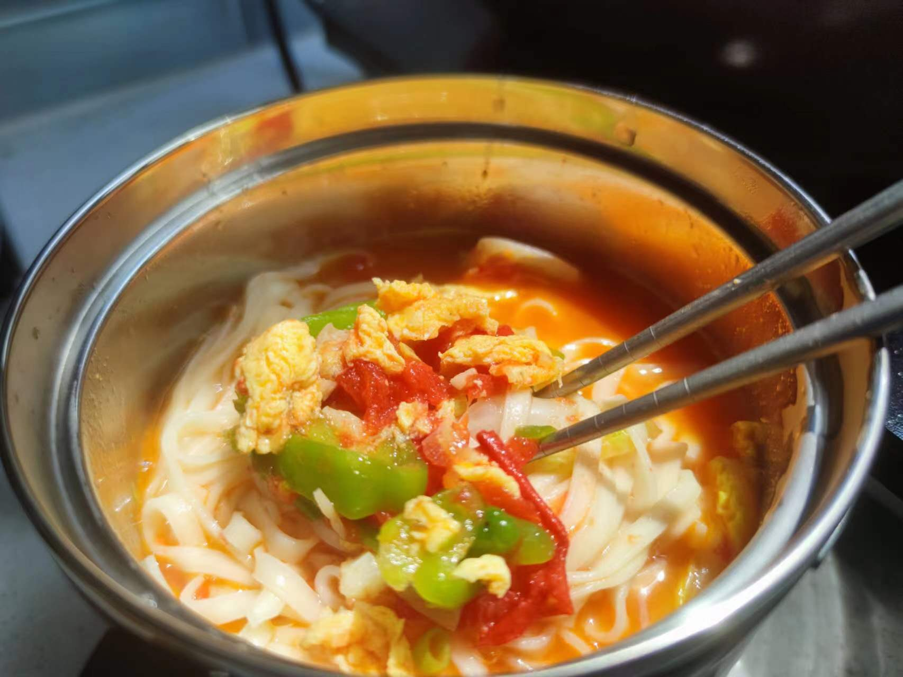

# Tomato and Egg Noodles Recipe

What if there are too many dried noodles? What if the taste of boiled plain noodles is unpalatable? How to cook delicious noodles with simple ingredients?
Tomato and egg noodles only require simple ingredients, quick operation, and few cooking utensils to solve all the troubles of **not wanting to bother**, **too many dried noodles**, and **simple ingredients**
Here, I would also like to thank my mother for her online guidance: v:
Simple and easy to make, let's start!
Production time: 20 minutes

Estimated cooking difficulty: ★★

## Essential Ingredients and Tools

- Dried noodles or fresh noodles are also acceptable
- One tomato
- Salt
- Eggs
- Scallions
- Soy sauce, oyster sauce or chicken essence
- White sugar (to neutralize the sour taste of tomatoes, no need to add if the tomatoes are not sour)
- Green peppers (non-line peppers)
- Sesame oil

## Calculation

You need to determine how many servings you plan to make before each production. The following servings are just enough for 1 person to eat

Total amount:

- A handful of dried noodles (depending on your appetite) 50-100g
- 1 tomato, about 200g.
- Eggs 1~2
- Salt 5g
- Oyster sauce 5g or chicken essence 3g
- White sugar 2g
- Soy sauce 5-8g
- Cooking oil 20g
- Sesame oil 5g

## Operation

### Pre-processing of ingredients

Pre-processing of ingredients is very important. No matter what dish you make, pre-processing in advance will prevent you from being flustered during the cooking process, and the production will be a very comfortable process. This... may be why the back kitchen needs a separate打荷 (打荷) (ingredient preparation) position

- Wash the scallions and chop them into scallions
- Cut the tomatoes into pieces. If you are not good at cutting, it is recommended to search on Baidu first~
- Cut the green peppers into diamond-shaped pieces
- Beat the raw eggs into a small bowl and whisk. If the eggs have a fishy smell, you can add 2g of white vinegar to remove the fishy smell

### Pre-processing of eggs

- Heat the pot, pour in 15~20g of cooking oil. If you want to stir-fry the eggs until tender and smooth, you need more oil, and at the same time leave some base oil for stir-frying the tomatoes later
- When the oil temperature reaches 70% heat (feel the heat about 10cm away from the palm), pour in the egg liquid and quickly划散 (划散) (scramble)
- After the eggs slide to solidify, pour them into a small bowl and set aside. Leave some base oil here

> There are no photos of eggs, use online pictures instead

### Making tomato and egg sauce

- After leaving the base oil in the pot, first add the white parts of the scallions and minced garlic and stir-fry until fragrant
- Add tomato pieces and green peppers, and wait for the tomatoes to fry out a little juice
- At this time, quickly add 5g of soy sauce and 2g of white sugar
- After stir-frying for ten seconds, add a bowl of clear water (just enough to cover the tomatoes)
- After boiling, add the stir-fried eggs, add 5g of oyster sauce or 2g of chicken essence to enhance the flavor
- Simmer over medium-low heat to collect the juice. During this period, stir to prevent sticking to the pot. After collecting the juice to the following picture, add a little chopped green onion (the remaining green parts of the scallions) and sesame oil (you can skip it), and the sauce is complete

### Finally cook the noodles

- You don’t need to wash the pot, just add 500ml of clear water
- Add the dried noodles after boiling, add 100ml of clear water after the dried noodles are cooked until soft
- After boiling again, if the noodles float up, add another 100ml of clear water
- After boiling, see if both sides of the noodles are transparent. If they are transparent, they are cooked
- Scoop the noodles into the sauce bowl and mix the noodles

## Additional Content

- Adding 2g of black pepper to the egg liquid will taste better
- Adding 2g of white pepper to enhance the spicy flavor during the process of simmering the sauce
- It is also possible to cook the noodles thoroughly at one time. Adding water multiple times is to make the noodles taste劲道 (劲道) (chewy) and not sticky. The trick is to add cold water as soon as it boils, and repeat this two or three times

If you follow this guide and find any problems or improvements, please submit an Issue or Pull request.
