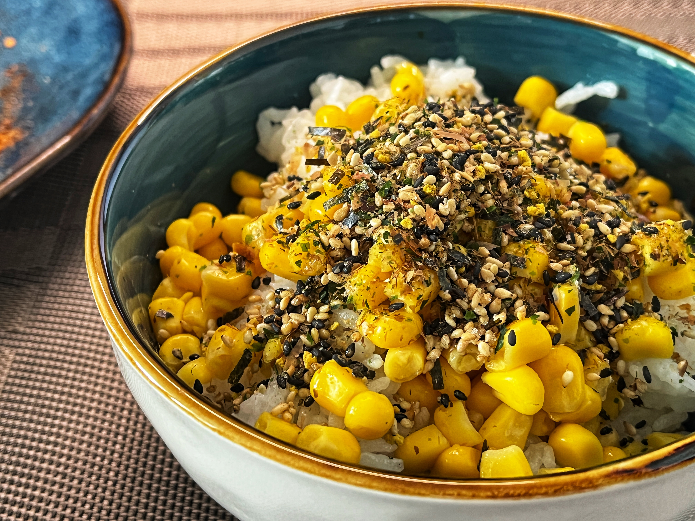

# Skipjack Tuna Seaweed Corn Rice Recipe

Air fryer lamb chops super lazy version, the taste is acceptable, mainly depends on the quality of the lamb chops.

- Total cooking time: 40 minutes (3 minutes preparation + 40 minutes cooking rice + 2 minutes mixing rice)
- Actual operation time: 5 minutes

Estimated cooking difficulty: ★★

## Essential Ingredients and Tools

- Required: Northeast rice (Jinlongyu 30 yuan 5kg is fine, it is recommended to use Mijia IH rice cooker to cook, the tutorial uses Mijia small rice cooker, **it is not recommended to use a pressure cooker to cook rice**)
- Required: Skipjack tuna seaweed crumbs (both JD and Taobao have them, you can search for: Japanese rice topping)
- Required: Corn kernels (Taobao search: instant corn kernels)

## Calculation

- Skipjack tuna seaweed crumbs 20g
- Corn kernels 80g/bag

## Operation

- Serve the rice, add the corn kernels and mix well
- Add skipjack tuna seaweed crumbs

## Additional Content

- If you use Mijia small rice cooker to cook Northeast rice, the water should be 3 mm over the rice. If there is too much water, the cooked rice will not be grain by grain

If you follow this guide and find any problems or improvements, please submit an Issue or Pull request.
