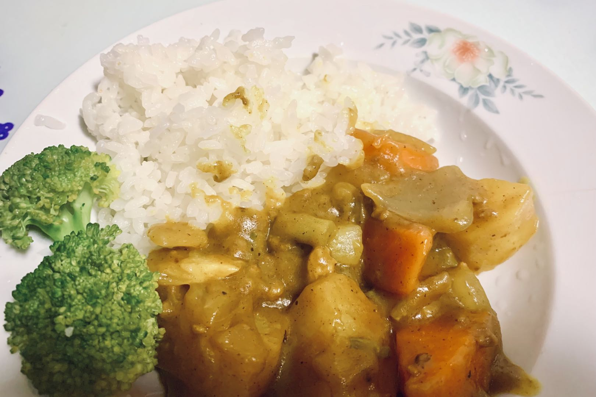

# Example Dish Recipe

<!-- This is an example recipe template file in the HowToCook recipe repository. -->
<!-- Note: When writing, there must be one and only one space between Chinese and English or numbers. -->
<!-- Note: When writing, there must be one and only one blank line between the title and the body. -->

# How to Make Example Dish

<!-- The title must be `Dish Name` + `How to Make`. Consistent with the file name. -->

<!-- It's better to have a picture. -->

<!-- Briefly introduce the characteristics, nutritional value, difficulty, and estimated production time of the dish here. -->
Example dish is a simple and easy dish to make. Rich in DHA and protein. Generally, beginners only need 3 hours to complete it. It also has a beauty effect~

<!--
1 star: There are no particularly difficult steps. You only need to simply mix and cook the raw materials. It can be completed in about 5 minutes. Even people without cooking experience can follow the steps to produce a decent effect.
2 stars: The included steps are very simple. You don't need much cooking experience, just follow the steps. It can be completed in about 10 minutes. Even people without cooking experience can follow the steps to produce a decent effect, but it takes some practice to achieve a perfect effect.
3 stars: The included steps are not too complicated. You need some cooking experience to be able to skillfully master the skills of heat, time, and material combination. It can be completed in about 15 minutes. It is not too difficult for experienced chefs, but it also takes some experience and practice to achieve a perfect effect.
4 stars: Contains many complicated steps. You need to master the skills of heat, time, and material combination exquisitely. It can be completed within 40 minutes. Even experienced chefs need to spend a lot of time preparing this dish, but after becoming proficient, they can produce a very delicious effect.
5 stars: Contains many complicated steps. You need to master the skills of heat, time, and material combination exquisitely. It may take more than 40 minutes to complete. Even experienced chefs need to spend a lot of time preparing this dish, and it is very easy to make mistakes.
-->

Estimated cooking difficulty: ★★★★

## Essential Ingredients and Tools

<!-- List the necessary ingredients here. To facilitate everyone to quickly judge whether the materials at hand are sufficient. -->

<!-- Note: Some ingredients have already been mentioned in the kitchen purchase section. Do not repeat them here: -->
<!-- Gas stove, drinking water, pot, cooking oil, bowls and plates, chopsticks, spatula, detergent, rag, steel wool, kitchen knife -->

<!-- You can recommend which brand to buy to facilitate decision-making. -->

*   Curry block (recommended brand House Foods)
*   Potato
*   Tengjiao oil (optional)

## Calculation

<!-- This section introduces some calculation formulas to obtain the amount of raw materials, important time parameters, and mixing ratios, so that they can be cited in subsequent operations. -->

<!-- There are two situations here: -->
<!-- 1. You may make dishes in large quantities. For example: the cafeteria makes tomato scrambled eggs, rice, and rice porridge for all students. In this case, you need to give a calculation formula. -->
<!-- 2. Fixed dish products. The capacity of each serving is consistent and will never change. In this case, you need to give the amount of one serving. -->

You need to determine how many servings you plan to make before each production. One serving is just enough for 2 people.

Per serving:

<!-- For ingredients of different sizes, you must provide a quality reference -->
<!-- For ingredients that can be added in your own discretion, you must provide a suggested addition range -->
<!-- Please do not use containers of varying sizes as units! This will be confusing and difficult to refine in the future. Please use milliliters! -->

*   Curry block 115g
*   Potatoes 2 (each potato weighs about 120g, a total of about 240g)
*   Cooking oil 10-15ml

## Operation

<!-- Describe the entire process of cooking in detail here. -->
<!-- Inaccurate descriptive words are not allowed, such as: `appropriate amount`, `small amount`, `medium amount`, `appropriate`. -->
<!-- Here, if the operated ingredient is not "all ingredients" but "part of the ingredients", it must also be specified. Otherwise, the default designation is all raw materials. For example, here 'potato' means 'all prepared potatoes'. -->

*   Peel the potatoes and cut them into large pieces no more than 4cm, set aside
*   Chop the curry block to increase the contact area and speed up dissolution, set aside
*   Heat the pot, add 10ml - 15ml of cooking oil to the pot. Wait 10 seconds for the oil temperature to rise
*   Add potatoes, keep stir-frying until the potatoes *soften* (can be confirmed with chopsticks) <!-- Do not add ingredients that are not mentioned in the text or raw materials in the description process. -->
*   Add water to cover all ingredients, after boiling, reduce the heat and then **wait 15 - 20 minutes** <!-- For ingredients that can be added in your own discretion, you must provide a suggested range -->
*   Turn off the heat, add curry and stir, wait until the curry melts <!-- All steps that require waiting must give a `waiting time calculation formula` or `criteria for ending a step` -->
*   Turn on the heat again, **stir slowly for 10 minutes** to prevent the pot from burning
*   Turn off the heat and plate after the appearance is *viscous*

## Additional content

<!-- Add some extra notes, references, safety instructions, etc. here. -->

*   When operating, you need to pay attention to observing the boiling water level. If you find that it is lower than 2/3 of the ingredients, you should add hot water to cover the ingredients.
*   Reference: [World Food Tutorial's Weibo Video](http://t.cn/EJ77yFy)

<!-- Must keep the following text. -->
If you follow this guide and find any problems or improvements, please submit an Issue or Pull request.

<!-- Before submitting a Pull Request, please delete all comments in the template. -->
