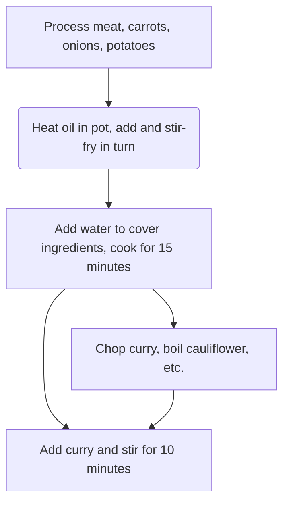

# Japanese Curry Rice Recipe

Estimated cooking difficulty: ★★★★

## Essential Ingredients and Tools

### Main ingredients

- Curry roux (recommended brand House Foods)
- Potatoes
- Carrots
- Onions
- Meat (pork, chicken, or beef)
- Garlic

### Side ingredients

Optional ingredients for embellishment

- Cauliflower (boiled in clear water)
- Bacon (ready to eat)
- Fried egg or[Sunny-side up egg](../../breakfast/太阳蛋.md)

## Calculation

The amount of ingredients is proportional to the curry. The calculation part takes **half a box of House Foods curry roux (115g)** as an example. Half a box is about 6 servings. The prepared curry tastes better after being refrigerated in the refrigerator, so don’t worry about not being able to finish it by yourself.

- Onions 2
- Potatoes 2
- Carrots 1
- Garlic 2~3 cloves
- Meat 2 斤 (斤) (jin)

## Operation

### 1. Ingredient preparation

- Remove the head and tail of the carrots, peel them, and cut them into滚刀 (滚刀) (rolling cut)
- Peel the outer layer of the onion, remove the core, and cut into crescent shapes
- Peel the potatoes and cut them into large pieces
- Cut the meat into pieces
- Peel the garlic, flatten it and chop it
- Chop the curry roux to increase the contact area and speed up dissolution

### 2. Cooking process

- Heat the oil in a pot, add garlic and meat, **stir-fry quickly** until the *surface of the meat turns white*
- Add carrots and **stir-fry quickly** until evenly heated
- Add onions and **stir-fry quickly** until the onions *become transparent*
- Add potatoes and keep stirring until the potatoes *soften* (you can use chopsticks to confirm)
- Add water to cover all ingredients, bring to a boil and **wait 15 minutes**
- Turn off the heat, add curry and stir
- After the curry melts, turn on the heat again and **stir slowly for 10 minutes** to prevent sticking to the pot
- Turn off the heat and end the production when the appearance is *viscous*

### 3. Heating after refrigeration

Take out the amount of refrigerated curry you need to eat each time, heat it and cover it on[Rice](../米饭/电饭煲蒸米饭.md).

- Microwave: 2-3 minutes on high heat for a single serving
- Pot: You need to add an extra 50ml of water and keep stirring while heating

## Additional Content

### Remarks

- Steps 1-6 can be performed during the waiting process of 2-5. During this process, you can also boil some vegetables in a clear water pot, or make a fried egg.
- From 2-5 to 2-6, pay attention to observing the boiling water level. If it is found to be lower than 2/3 of the ingredients, add hot water to cover the ingredients.

### Flow chart

### Finished product

### Reference materials

- [World Gourmet Tutorial's Weibo video](http://t.cn/EJ77yFy)

---
If you follow this guide and find any problems or improvements, please submit an Issue or Pull request.
