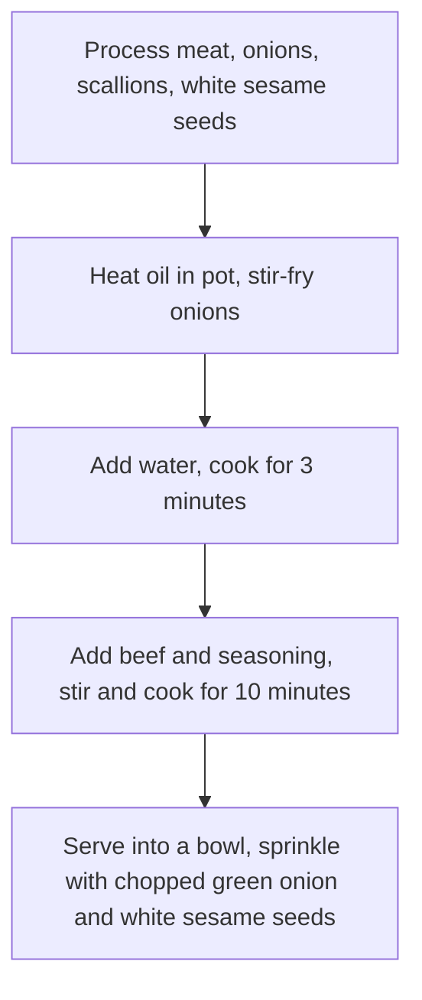

# Japanese Beef Bowl Recipe

Estimated cooking difficulty: ★★★★

## Essential Ingredients and Tools

### Main ingredients

- Onion (be sure to use onions with a white-yellow skin, do not use purple onions)
- Beef (hot pot beef is fine, you can also use original cut beef slices)
- Scallions (you can also use chopped scallions)
- White sesame seeds
- Mirin (a common Japanese seasoning, which can be purchased on major e-commerce platforms, or can be replaced with cooking wine)

### Side ingredients

Optional ingredients for embellishment

- [Onsen egg](../../breakfast/温泉蛋/温泉蛋.md)
- Dashi (soup made with dried bonito and kelp, which can be used to enhance freshness)

## Calculation

The amount of ingredients is proportional to the rice. The calculation part takes **one cup of rice (160ml)** as an example. It is about the amount for two people to eat. If you can't finish it, you can refrigerate it, but it may not taste so good.

- Onion 1
- Beef 250 grams
- Scallions 1~2
- White sesame seeds 5 grams

## Operation

### 1. Ingredient preparation

- Peel the outer layer of the onion, remove the core, and cut into crescent shapes
- Wash the scallions and cut them into 0.5cm small sections
- Heat the pot and put the white sesame seeds directly into it. **Shake the pot back and forth** to heat the sesame seeds evenly until they are *slightly golden brown*
- Blanch the beef for 1 minute and remove it
- Mix 40g `味淋 (味淋) (mirin)` (or 30g `料酒 (料酒) (cooking wine)`), 30g `酱油 (酱油) (soy sauce)`, 20g `耗油 (耗油) (oyster sauce)`, 5g `糖 (糖) (sugar)`, 5g `老抽 (老抽) (dark soy sauce)` (optional, for coloring) in a bowl to form a `调料 (调料) (seasoning)` (this step can be done directly by placing the bowl on an electronic scale)

### 2. Cooking process

- Heat the oil in a pot and add the onions, **stir-fry quickly** until the onions *become transparent*
- Turn to low heat, add 250g of water (or dashi), turn back to high heat and heat **wait 3 minutes**
- Add beef and `调料 (调料) (seasoning)`
- **Constantly stir** all ingredients for **10 minutes** to prevent the ingredients from sticking to the pot
- Turn off the heat
- Serve the beef bowl on[Rice](../米饭/电饭煲蒸米饭.md) (be sure to pour some of the juice on the rice)
- Sprinkle with chopped green onion and white sesame seeds to complete.

### 3. Heating after refrigeration

Take out the amount of refrigerated beef bowl you need to eat each time, heat it and cover it on[Rice](../米饭/电饭煲蒸米饭.md).

- Microwave: 2-3 minutes on high heat for a single serving
- Pot: You need to add an extra 50ml of water and need to **stir constantly** while heating

## Additional Content

```shell
struct Staple{float 咸度;};
struct Staple 牛丼
牛丼.咸度 = 尝一口汤汁;
while(牛丼.咸度 < 预期) 加入(1 g)酱油; 牛丼.咸度 = 尝一口汤汁;
```

### Remarks

- If you are using better beef, you can choose not to blanch it to better preserve the flavor of the beef. Because mirin is added, it will not be very腥 (腥) (fishy). There is no need to worry about the beef not being cooked. It will definitely be cooked after heating for 10 minutes
- If conditions permit, choose to add 15g`清酒 (清酒) (sake)`

### Flow chart



### Finished product


### Reference materials

- [Heshui Yangyang Laboratory [Beef Bowl | Beef Rice] Authentic Recipe of Yoshinoya Beef Rice](https://www.bilibili.com/video/BV1rK4y1d7Fk)
- [Uncle Xia's Kitchen 60 seconds to get a fairy recipe, delicious and delicious beef rice!](https://www.bilibili.com/video/BV1xu4y1676X)

---
If you follow this guide and find any problems or improvements, please submit an Issue or Pull request.
